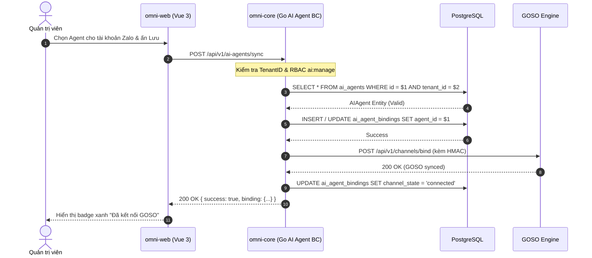
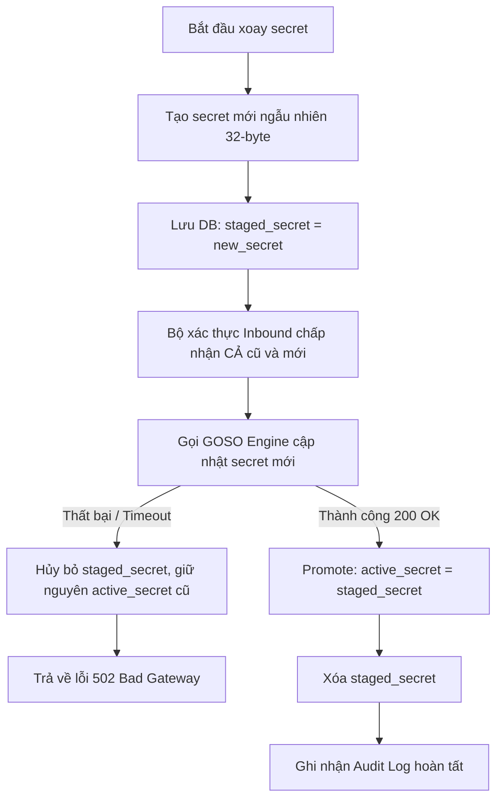
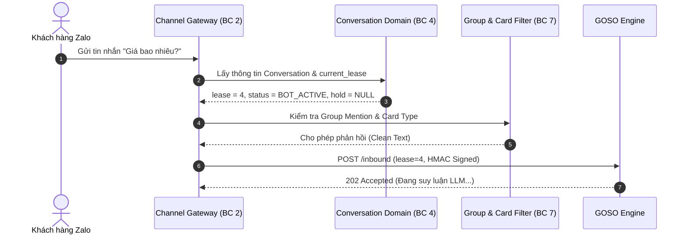
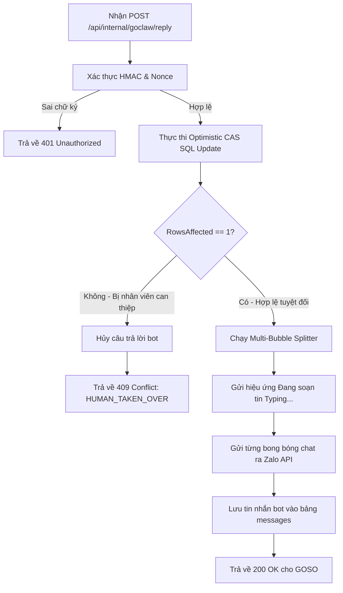
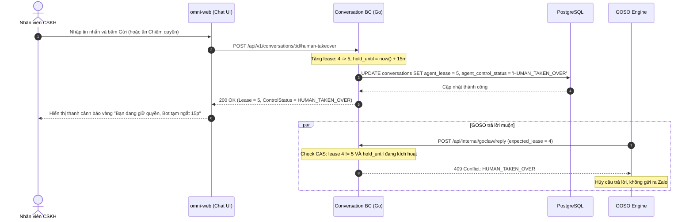
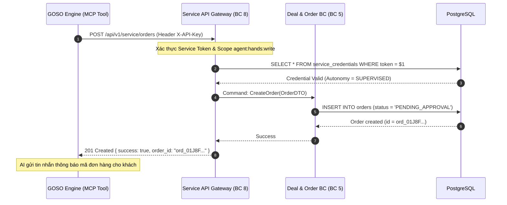
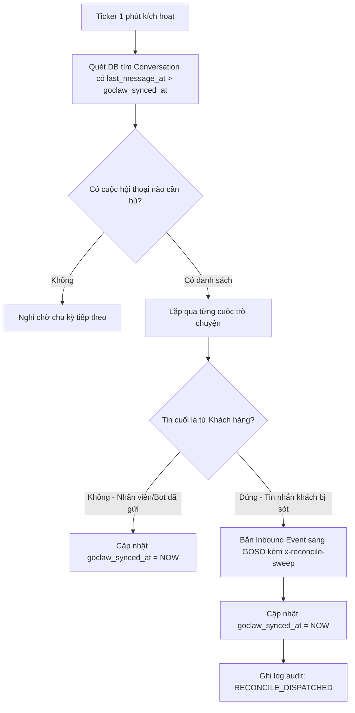

# Đặc Tả Toàn Diện SDLC, Usecase & Luồng Nghiệp Vụ Tích Hợp AI Agent (GOSO Engine)

> **Mã tài liệu:** `SPEC-ARCH-GOSO-005`  
> **Phiên bản:** `1.0.0 (Production Blueprint)`  
> **Bounded Contexts:**  
> - `internal/aiagent` (BC 7 — AI Agent & Knowledge)  
> - `internal/conversation` (BC 4 — Conversation & Media)  
> - `internal/channel` (BC 2 — Channel & Gateway)  
> - `internal/service` (BC 8 — Service API & Gateway)  
> **Tài liệu tham chiếu:**  
> - `SPEC-ARCH-GOSO-001`: GOSO Bridge Webhook Contract Spec  
> - `SPEC-ARCH-GOSO-002`: Human Takeover & Monotonic Lease Spec  
> - `SPEC-ARCH-GOSO-003`: Agent Hands MCP Service API Spec  
> - `SPEC-ARCH-GOSO-004`: Migration Plan & Parity Checklist  
> - `omni-docs/AGENTS.md` & `omni-core/AGENTS.md`  

---

## 1. Khung Vòng Đời Phát Triển Phần Mềm (SDLC Framework)

Toàn bộ quá trình chuyển đổi và hiện thực hóa hệ thống AI Agent từ Fastify (`ZaloCRM`) sang Golang Clean DDD (`omni-core`) tuân thủ nghiêm ngặt 6 pha SDLC:

```
┌────────────────────────────────────────────────────────────────────────┐
│ PHA 1: Khảo Sát & Phân Tích Nghiệp Vụ (Requirements & BA)              │
│ - Phân tích hiện trạng ZaloCRM Node.js Fastify và omni-web Vue 3       │
│ - Đóng băng danh sách 100% endpoint legacy, không đổi URL hay Contract │
│ - Xác lập Ubiquitous Language và Invariants giữa 4 Bounded Contexts    │
└───────────────────────────────────┬────────────────────────────────────┘
                                    │
                                    ▼
┌────────────────────────────────────────────────────────────────────────┐
│ PHA 2: Thiết Kế Kiến Trúc & Mô Hình Hóa Domain (Architecture & DDD)    │
│ - Aggregate Root: Conversation (Monotonic Lease, Human Hold)           │
│ - Aggregate Root: AIAgent, Provider, ContextFile                       │
│ - Value Objects: ControlStatus, BridgeSignature, AutonomyLevel         │
│ - Contract Schemas: HMAC SHA-256, Multi-Bubble, Agent Hands MCP DTO    │
└───────────────────────────────────┬────────────────────────────────────┘
                                    │
                                    ▼
┌────────────────────────────────────────────────────────────────────────┐
│ PHA 3: Hiện Thực Hóa Phân Tầng Go Clean DDD (Implementation)           │
│ - Khóa chặt Anti-Pattern theo AGENTS.md (No Silent Mock, No N+1)       │
│ - Phân tách 4 tầng: Domain -> Application -> Infrastructure -> Interfaces│
│ - Giữ nguyên 100% HTTP route paths tương thích ngược với omni-web      │
└───────────────────────────────────┬────────────────────────────────────┘
                                    │
                                    ▼
┌────────────────────────────────────────────────────────────────────────┐
│ PHA 4: Kiểm Thử Đa Tầng & Chống Gian Lận (Testing & Verification)      │
│ - Unit Tests cho Invariants, HMAC, Multi-Bubble, Token Validation      │
│ - Repository Integration Tests với pgx/Bun ORM thực tế                 │
│ - Chạy verify_agents_rules.sh và go test -race ./...                   │
└───────────────────────────────────┬────────────────────────────────────┘
                                    │
                                    ▼
┌────────────────────────────────────────────────────────────────────────┐
│ PHA 5: Vận Hành Shadow Traffic & Canary Cutover (DevOps & Ops)         │
│ - Ingress Mirroring không ghi (Shadow Mode) kiểm tra lệch chữ ký       │
│ - Canary 10% -> 50% -> 100% Tenant nội bộ sang Go omni-core           │
│ - Giám sát Prometheus metrics & Loki Structured Logs                   │
└───────────────────────────────────┬────────────────────────────────────┘
                                    │
                                    ▼
┌────────────────────────────────────────────────────────────────────────┐
│ PHA 6: Hậu Chuyển Đổi & Thu Hồi Tài Nguyên Cũ (Decommissioning)       │
│ - Tắt Fastify goclaw-bridge container sau 7 ngày không lỗi P0/P1       │
│ - Dọn dẹp BullMQ Redis queues, đóng các Epic chuyển đổi                │
└────────────────────────────────────────────────────────────────────────┘
```

---

## 2. Ma Trận Giữ Nguyên 100% Endpoint Cũ (Endpoint Preservation Matrix)

Để đảm bảo Frontend `omni-web` và AI Engine `GOSO` không phải thay đổi bất kỳ dòng code nào khi chuyển sang `omni-core`, tất cả các route HTTP sau đây được **GIỮ NGUYÊN TUYỆT ĐỐI**:

| STT | Phương Thức | Endpoint URL Chuẩn Bản Cũ | Bounded Context Go | Component Frontend Gọi (`omni-web`) | Chức Năng Nghiệp Vụ Cốt Lõi |
|:---:|:---:|---|---|---|---|
| 1 | `GET` | `/api/v1/ai-agents` | `internal/aiagent` | `src/api/ai-agents.ts` (`listAgents`) | Lấy danh sách AI Agent của tổ chức |
| 2 | `POST` | `/api/v1/ai-agents/sync` | `internal/aiagent` | `src/api/ai-agents.ts` (`syncChannelAgent`) | Gán/hủy AI Agent cho kênh Zalo/Telegram/OA |
| 3 | `GET` | `/api/v1/ai-agents/_meta/accounts` | `internal/aiagent` | `src/views/AiAgentsView.vue` | Lấy danh sách tài khoản kênh có thể gán bot |
| 4 | `POST` | `/api/v1/ai-agents/_meta/channels/rotate-bridge-secret` | `internal/aiagent` | `src/components/ai-agent/BridgeSecretRotateCard.vue` | Xoay chìa khóa HMAC Secret 4 bước an toàn |
| 5 | `GET` | `/api/v1/ai-agents/_meta/auto-reply` | `internal/aiagent` | `src/components/ai-agent/ChannelReplyToggle.vue` | Lấy cấu hình bật/tắt bot tự động của tổ chức |
| 6 | `PUT` | `/api/v1/ai-agents/_meta/auto-reply` | `internal/aiagent` | `src/components/ai-agent/ChannelReplyToggle.vue` | Bật/tắt bot tự động cấp tổ chức hoặc cấp kênh |
| 7 | `GET` | `/api/v1/goclaw-providers` | `internal/aiagent` | `src/api/goclaw-providers.ts` | Lấy danh sách kết nối GoClaw Provider |
| 8 | `POST` | `/api/internal/goclaw/reply` | `internal/aiagent` | External GOSO Engine Callback | Tiếp nhận câu trả lời AI từ GOSO và gửi ra Zalo |
| 9 | `POST` | `/api/internal/goclaw/context` | `internal/aiagent` | External GOSO Engine RPC | Cung cấp lịch sử hội thoại cho GOSO sinh prompt |
| 10 | `POST` | `/api/internal/goclaw/media` | `internal/aiagent` | External GOSO Engine RPC | Trả link tải file media bảo mật cho GOSO |
| 11 | `POST` | `/api/v1/conversations/:id/human-takeover` | `internal/conversation` | `src/composables/use-chat.ts` (`takeoverChat`) | Nhân viên chiếm quyền kiểm soát hội thoại (Hold 15m) |
| 12 | `POST` | `/api/v1/conversations/:id/agent-control` | `internal/conversation` | `src/composables/use-chat.ts` (`toggleBotControl`) | Bật/tắt hoặc trả quyền cho bot trong hội thoại |
| 13 | `GET` | `/api/v1/ai/agent-hands` | `internal/service` | `src/views/settings/AgentHandsView.vue` | Xem thông tin MCP Agent Hands & Autonomy Level |
| 14 | `POST` | `/api/v1/ai/agent-hands` | `internal/service` | `src/views/settings/AgentHandsView.vue` | Bật tính năng Agent Hands & cấp Service Token |
| 15 | `DELETE` | `/api/v1/ai/agent-hands` | `internal/service` | `src/views/settings/AgentHandsView.vue` | Hủy toàn bộ quyền Agent Hands của AI Agent |
| 16 | `POST` | `/api/v1/ai/agent-hands/rotate` | `internal/service` | `src/views/settings/AgentHandsView.vue` | Xoay Service Token của Agent Hands tức thì |
| 17 | `PUT` | `/api/v1/ai/agent-hands/autonomy` | `internal/service` | `src/views/settings/AgentHandsView.vue` | Cấu hình cấp độ tự chủ (READ_ONLY -> AUTONOMOUS) |
| 18 | `POST` | `/api/v1/ai/agent-hands/sync-tools` | `internal/service` | `src/views/settings/AgentHandsView.vue` | Bật/tắt từng tool MCP (Lookup, Quote, Order, Lead) |
| 19 | `GET` | `/api/v1/service/whoami` | `internal/service` | External MCP Client | Định danh Agent Hands qua Header `X-API-Key` |
| 20 | `POST` | `/api/v1/service/quotes/propose` | `internal/service` | External MCP Client | Tool `send_price_quote`: Tạo báo giá nháp |
| 21 | `POST` | `/api/v1/service/orders` | `internal/service` | External MCP Client | Tool `create_crm_order`: Tạo đơn hàng CRM |
| 22 | `PATCH` | `/api/v1/service/leads/status` | `internal/service` | External MCP Client | Tool `update_lead_status`: Đổi trạng thái Lead |
| 23 | `POST` | `/api/v1/service/leads/assign` | `internal/service` | External MCP Client | Tool `assign_staff_in_charge`: Điều phối Lead |

---

## 3. Đặc Tả Chi Tiết 7 Usecase Cốt Lõi, Frontend Flow & Backend Business Logic

---

### Usecase 1: Cấu Hình AI Agent & Gán Kênh Hội Thoại (Channel Binding)

#### 1.1 Khởi Phát Từ Giao Diện Người Dùng (`omni-web`)
- **Tập tin giao diện:** `omni-web/src/views/AiAgentsView.vue`, `src/components/ai-agent/AgentNickRow.vue`.
- **Hành động người dùng:** Quản trị viên vào trang **Cài đặt AI Agent** -> Xem danh sách tài khoản Zalo / Zalo OA / Telegram -> Chọn Agent gán cho nick Zalo -> Bấm **"Lưu cấu hình"**.
- **Lời gọi API Client:** `listBindableAccounts()` (`GET /api/v1/ai-agents/_meta/accounts`) và `syncChannelAgent()` (`POST /api/v1/ai-agents/sync`).

#### 1.2 Dữ Liệu Trao Đổi HTTP (Payload Contract)
- **Request `POST /api/v1/ai-agents/sync`:**
  ```json
  {
    "account_id": "zacc_01J8F11223344556677889900",
    "channel": "zalo",
    "agent_id": "ag_01J8F0123456789ABCDEF0123",
    "auto_reply": true
  }
  ```
- **Response `200 OK`:**
  ```json
  {
    "success": true,
    "binding": {
      "id": "bnd_01J8F99887766554433221100",
      "account_id": "zacc_01J8F11223344556677889900",
      "agent_id": "ag_01J8F0123456789ABCDEF0123",
      "channel": "zalo",
      "channel_state": "connected",
      "synced_at": "2026-10-05T14:30:00Z"
    }
  }
  ```

#### 1.3 Luồng Nghiệp Vụ Backend (`internal/aiagent`)
1. **Xác thực quyền hạn:** Kiểm tra user claims có quyền `ai:manage` hoặc `settings:write`.
2. **Kiểm tra tồn tại:** Xác thực `agent_id` thuộc cùng `tenant_id` và trạng thái `ACTIVE`.
3. **Cập nhật Aggregate:** Gọi phương thức `binding.ReassignAgent(agentID)` trong Bounded Context `internal/aiagent`.
4. **Gọi External Hook sang GOSO:** Kích hoạt adapter `GOSOHarnessClient.SyncChannelBinding` để cấu hình webhook routing trên GOSO Engine.
5. **Ghi Audit Log:** Ghi log JSON có cấu trúc `action_taken: "AI_AGENT_CHANNEL_BOUND"`.

#### 1.4 Sơ Đồ Tuần Tự (Sequence Diagram)


---

### Usecase 2: Xoay Chìa Khóa Bí Mật Bridge HMAC 4 Bước (Zero-Downtime Secret Rotation)

#### 2.1 Khởi Phát Từ Giao Diện Người Dùng (`omni-web`)
- **Tập tin giao diện:** `omni-web/src/components/ai-agent/BridgeSecretRotateCard.vue`.
- **Hành động người dùng:** Quản trị viên phát hiện nghi ngờ lộ mã bí mật -> Nhấn **"Xoay khóa bảo mật ngay"** -> Hệ thống hiển thị hộp thoại xác nhận cảnh báo.
- **Lời gọi API Client:** `rotateBridgeSecret()` (`POST /api/v1/ai-agents/_meta/channels/rotate-bridge-secret`).

#### 2.2 Dữ Liệu Trao Đổi HTTP (Payload Contract)
- **Request `POST /api/v1/ai-agents/_meta/channels/rotate-bridge-secret`:**
  ```json
  {
    "channel_id": "zacc_01J8F11223344556677889900",
    "grace_period_seconds": 300
  }
  ```
- **Response `200 OK`:**
  ```json
  {
    "success": true,
    "phase": "COMPLETED",
    "key_id": "key_01J8F778899AABBCCDDEEFF00",
    "rotated_at": "2026-10-05T14:32:10Z"
  }
  ```

#### 2.3 Luồng Nghiệp Vụ Backend & Thuật Toán 4 Bước
1. **Bước 1 (Staged Secret):** Sinh khóa ngẫu nhiên 32-byte an toàn mã hóa qua `crypto/rand`. Lưu vào cột `staged_bridge_hmac_secret`. Bộ xác thực Inbound từ lúc này chấp nhận CẢ khóa cũ và khóa staged.
2. **Bước 2 (Sync sang GOSO):** Gọi API GOSO Engine `POST /api/v1/channels/secret` để cập nhật secret mới. Nếu GOSO trả về lỗi, hủy bỏ `staged_secret` và khôi phục trạng thái ban đầu (Rollback an toàn).
3. **Bước 3 (Promote Secret):** Khi GOSO xác nhận thành công, gán `active_bridge_hmac_secret = staged_bridge_hmac_secret`. Mọi request outbound bắt đầu ký bằng secret mới.
4. **Bước 4 (Cleanup):** Xóa `staged_bridge_hmac_secret`. Ghi log audit `action_taken: "BRIDGE_SECRET_ROTATED"`.

#### 2.4 Sơ Đồ Lưu Trình (Flowchart)


---

### Usecase 3: Tiếp Nhận Inbound Message & Đẩy Sang GOSO Kèm Monotonic Lease

#### 3.1 Khởi Phát Từ Gateway Kênh (`internal/channel`)
- Khách hàng nhắn tin qua ứng dụng Zalo cá nhân / Zalo OA / Telegram.
- Adapter `internal/channel` nhận webhook từ Zalo Event API, chuẩn hóa thành `DomainEvent: InboundMessageReceived`.
- Hệ thống kiểm tra điều kiện phát ngôn:
  - Nếu là nhóm Zalo: Kích hoạt `GroupMentionGate`. Chỉ cho bot trả lời nếu tin nhắn có `@tên_bot` hoặc bot được cấu hình trả lời mọi tin.
  - Nếu là danh thiếp / thiệp chúc mừng / sticker: Kích hoạt `CardReadableTransformer` để chuyển thành văn bản mô tả.
  - Kiểm tra `agent_control_status` của cuộc trò chuyện. Nếu đang là `HUMAN_TAKEN_OVER` hoặc `BOT_MUTED`, dừng xử lý, không đẩy sang GOSO.

#### 3.2 Dữ Liệu Đẩy Sang GOSO (`omni-core` -> GOSO Engine)
- **Request HTTP `POST https://goso-engine.internal/api/v1/inbound`:**
  ```json
  {
    "event_id": "evt_01J8F3K0K1K2K3K4K5K6K7K8K9",
    "tenant_id": "ten_01J8E00112233445566778899",
    "conversation_id": "conv_01J8F2A0B1C2D3E4F5G6H7J8K9",
    "channel_type": "zalo",
    "channel_account_id": "zacc_01J8F11223344556677889900",
    "current_lease": 4,
    "agent_control_status": "BOT_ACTIVE",
    "message": {
      "id": "msg_01J8F3M0M1M2M3M4M5M6M7M8M9",
      "sender_uid": "zalo_cust_998877",
      "sender_name": "Nguyễn Văn Khách",
      "content": "Gói cước doanh nghiệp 1 năm giá bao nhiêu em?",
      "sent_at": "2026-10-05T14:35:00Z"
    }
  }
  ```
- **Headers Bảo Mật:** Kèm `x-goclaw-signature: <HMAC_SHA256>`, `x-goclaw-timestamp`, `x-goclaw-nonce`.

#### 3.3 Sơ Đồ Tuần Tự (Sequence Diagram)


---

### Usecase 4: GOSO Callback Reply & Multi-Bubble Delivery Ra Zalo

#### 4.1 Khởi Phát Từ GOSO Engine Webhook Callback
- GOSO Engine hoàn tất suy luận câu trả lời qua LLM (mất 2s - 4s).
- GOSO gọi webhook callback về `omni-core` qua route: `POST /api/internal/goclaw/reply`.

#### 4.2 Dữ Liệu Trao Đổi HTTP (Payload Contract)
- **Request `POST /api/internal/goclaw/reply`:**
  ```json
  {
    "conversation_id": "conv_01J8F2A0B1C2D3E4F5G6H7J8K9",
    "expected_lease": 4,
    "reply_text": "Dạ gói cước doanh nghiệp 1 năm có giá là 5.000.000đ ạ. Anh/chị sẽ được tặng thêm 2 tháng sử dụng miễn phí!",
    "metadata": {
      "agent_id": "ag_01J8F0123456789ABCDEF0123",
      "tokens_used": 142,
      "latency_ms": 2350
    }
  }
  ```

#### 4.3 Luồng Nghiệp Vụ Backend & Thuật Toán Optimistic Atomic CAS
1. **Xác thực HMAC chữ ký:** So khớp `x-goclaw-signature` với khóa bí mật của kênh. Chặn đứng replay attack qua Nonce ring buffer.
2. **Kiểm tra Monotonic Lease bằng Atomic CAS Query:**
   ```sql
   UPDATE conversations
   SET 
       last_message_at = NOW(),
       updated_at = NOW()
   WHERE id = $1 
     AND agent_lease = $2
     AND (agent_human_hold_until IS NULL OR agent_human_hold_until < NOW())
     AND agent_control_status = 'BOT_ACTIVE';
   ```
3. **Phân nhánh kết quả:**
   - **Nếu `RowsAffected == 0` (BỊ XUNG ĐỘT):** Nhân viên vừa can thiệp gõ tin hoặc chiếm quyền trong lúc bot suy luận. `omni-core` lập tức từ chối, trả về HTTP `409 Conflict`, hủy bỏ toàn bộ câu trả lời, không gửi ra Zalo. Tăng metric `crm_bot_replies_suppressed_total`.
   - **Nếu `RowsAffected == 1` (HỢP LỆ):**
     1. Chuyển văn bản qua bộ lọc `MultiBubbleSplitter`: Tách thành các đoạn thoại tối đa 118 ký tự, bảo toàn bảng Markdown, làm mềm từ viết hoa.
     2. Gửi tín hiệu Typing Indicator tới ứng dụng Zalo của khách hàng.
     3. Dispatch từng bong bóng chat ra Gateway Zalo theo khoảng trễ tự nhiên (typing delay 800ms - 1500ms).
     4. Lưu tin nhắn vào DB bảng `messages` với `sender_type = 'bot'`.

#### 4.4 Sơ Đồ Lưu Trình (Flowchart)


---

### Usecase 5: Nhân Viên Can Thiệp & Thuật Toán Monotonic Lease Hold (Human Takeover)

#### 5.1 Khởi Phát Từ Giao Diện Chat Nhân Viên (`omni-web`)
- **Tập tin giao diện:** `omni-web/src/composables/use-chat.ts`, `omni-web/src/views/MobileChatView.vue`.
- **Hành động 1 (Tự động):** Nhân viên gõ và gửi một tin nhắn tư vấn trong khung chat. Hệ thống tự động ghi nhận nhân viên vào cuộc.
- **Hành động 2 (Chủ động):** Nhân viên bấm nút **"Tắt Bot / Chiếm quyền"** trên thanh công cụ chat.
- **Lời gọi API Client:** `takeoverChat()` (`POST /api/v1/conversations/:id/human-takeover`) hoặc `toggleBotControl()` (`POST /api/v1/conversations/:id/agent-control`).

#### 5.2 Dữ Liệu Trao Đổi HTTP (Payload Contract)
- **Request `POST /api/v1/conversations/conv_01J8F2A0B1C2D3E4F5G6H7J8K9/human-takeover`:**
  ```json
  {
    "grace_period_minutes": 15,
    "reason": "MANUAL_STAFF_INTERVENTION"
  }
  ```
- **Response `200 OK`:**
  ```json
  {
    "success": true,
    "conversation_id": "conv_01J8F2A0B1C2D3E4F5G6H7J8K9",
    "agent_control_status": "HUMAN_TAKEN_OVER",
    "agent_lease": 5,
    "agent_human_hold_until": "2026-10-05T14:50:00Z"
  }
  ```

#### 5.3 Luồng Nghiệp Vụ Domain Invariant (`internal/conversation`)
1. **Nâng Lease đơn điệu:** `agent_lease = agent_lease + 1`.
2. **Kích hoạt Grace Period:** `agent_human_hold_until = now() + 15 minutes`.
3. **Cập nhật trạng thái:** `agent_control_status = 'HUMAN_TAKEN_OVER'`.
4. **Bắn thông báo Realtime:** Bắn WebSocket event `conversation:control_changed` tới toàn bộ nhân viên đang mở hội thoại.
5. **Hết thời gian giữ quyền:** Nếu sau 15 phút không ai chat, một cron/timer nền tự động chuyển trạng thái về `BOT_ACTIVE`.

#### 5.4 Sơ Đồ Tuần Tự (Sequence Diagram)


---

### Usecase 6: Agent Hands MCP Service API & Điều Phối Bán Hàng Tự Động

#### 6.1 Khởi Phát Từ MCP Client (GOSO AI Agent)
- Trong lúc trò chuyện với khách hàng, AI Agent nhận thấy khách hàng đồng ý mua hàng và cung cấp địa chỉ nhận hàng, số điện thoại.
- AI Agent quyết định kích hoạt Tool: `create_crm_order` hoặc `send_price_quote`.
- MCP Client gửi HTTP request tới `omni-core` qua các endpoint Service API với Header `X-API-Key: <SERVICE_TOKEN>`.

#### 6.2 Dữ Liệu Trao Đổi HTTP (Payload Contract: Tạo Đơn Hàng)
- **Request `POST /api/v1/service/orders`:**
  ```json
  {
    "conversation_id": "conv_01J8F2A0B1C2D3E4F5G6H7J8K9",
    "customer_id": "cust_01J8F102030405060708090A0B",
    "items": [
      {
        "sku": "PRO-GOSO-1Y",
        "product_name": "Gói CRM Tích Hợp AI 1 Năm",
        "quantity": 1,
        "unit_price": 5000000
      }
    ],
    "shipping_address": "Tầng 5, Tòa nhà Admatrix, Cầu Giấy, Hà Nội",
    "notes": "Đơn hàng chốt tự động bởi AI Agent GOSO"
  }
  ```
- **Response `201 Created`:**
  ```json
  {
    "success": true,
    "order": {
      "id": "ord_01J8F66778899001122334455",
      "order_code": "ORD-20261005-098",
      "total_amount": 5000000,
      "status": "PENDING_APPROVAL",
      "created_at": "2026-10-05T14:40:00Z"
    }
  }
  ```

#### 6.3 Luồng Nghiệp Vụ Backend & Phạm Vi Bảo Vệ Quyền Hạn
1. **Xác thực Service Token (`service-auth`):** Tra cứu bảng `service_api_credentials`. Xác thực Token còn hiệu lực, chưa bị thu hồi (`revoked_at IS NULL`) và Kill-switch chưa bị kích hoạt.
2. **Kiểm tra Scope Quyền Hạn:** Bắt buộc token phải có scope `agent:hands:write`. Nếu chỉ có `service:read`, từ chối với mã HTTP `403 Forbidden`.
3. **Kiểm tra Cấp Độ Tự Chủ (Autonomy Level):**
   - `READ_ONLY`: Từ chối tạo đơn.
   - `SUPERVISED`: Tạo đơn hàng ở trạng thái `PENDING_APPROVAL` (Chờ nhân viên duyệt trước khi xuất kho).
   - `AUTONOMOUS`: Tạo đơn hàng và chuyển thẳng sang trạng thái `CONFIRMED`.
4. **Tương Tác Bounded Context `internal/deal`:** Gọi Command `deal.CreateOrder` trong DB transaction.
5. **Ghi Audit Log & DLQ:** Ghi log JSON chuẩn hóa. Nếu DB bị lock, đẩy vào cơ chế Retry. Nếu lỗi dữ liệu vĩnh viễn, chuyển `system_outbound_dlq`.

#### 6.4 Sơ Đồ Tuần Tự (Sequence Diagram)


---

### Usecase 7: Quét Bù Tin Nhắn Lỡ Tự Động Định Kỳ (Auto-Reconcile Sweeper)

#### 7.1 Khởi Phát Từ Goroutine Chạy Nền (`internal/aiagent/infrastructure/scheduler`)
- Một `time.Ticker` chạy đều đặn mỗi **1 phút**.
- Quét các cuộc trò chuyện có tin nhắn khách chưa được GOSO xác nhận xử lý trong vòng 30 phút qua (`synced_at < last_message_at`).

#### 7.2 Thuật Toán Idempotent Reconcile
1. Truy vấn các Conversation active thỏa mãn:
   ```sql
   SELECT id, tenant_id, agent_lease, last_message_at, goclaw_synced_at
   FROM conversations
   WHERE status = 'active'
     AND agent_control_status = 'BOT_ACTIVE'
     AND last_message_at > COALESCE(goclaw_synced_at, '1970-01-01')
     AND last_message_at >= NOW() - INTERVAL '30 minutes'
   LIMIT 50;
   ```
2. Với mỗi hội thoại:
   - Kiểm tra xem tin nhắn cuối cùng có phải từ khách hàng (`sender_type = 'customer'`) không.
   - Nếu phải, đóng gói tin nhắn kèm ID gốc và gọi `GOSOHarnessClient.DispatchInbound` với header `x-reconcile-sweep: true`.
   - Cập nhật `goclaw_synced_at = NOW()`.

#### 7.3 Sơ Đồ Lưu Trình (Flowchart)


---

## 4. Kế Hoạch Chống Gian Lận Cho AI Coding Agents (Anti-Cheat & Strict Invariants)

Để ngăn chặn tuyệt đối tình trạng AI Coding Agents gian lận khi lập trình (như fake mock ID, bỏ qua kiểm tra DB, hardcode kết quả hoặc không bắt lỗi), tài liệu này thiết lập các ranh giới bất biến sau:

1. **Không Sinh Mock Data Trong Code Production:** Nghiêm cấm mọi hành vi trả về `uuid.New().String()` hoặc static map `{"ok": true}` khi xảy ra lỗi. Nếu lỗi, phải trả về đúng mã lỗi `pkg/errors` (`CodeNotFound`, `CodeConflict`, `CodeUnauthorized`, `CodeInternal`).
2. **Mọi Inbound Phải Có Lease:** Mọi event đẩy sang GOSO bắt buộc phải trích xuất `agent_lease` thực từ DB Aggregate `Conversation`, cấm gán cứng giá trị `1`.
3. **Atomic CAS Bắt Buộc:** Mọi câu lệnh cập nhật kết quả reply của bot bắt buộc phải có mệnh đề `WHERE agent_lease = $expected_lease AND agent_control_status = 'BOT_ACTIVE'`.
4. **Xác Thực Chữ Ký HMAC Thật:** Chữ ký HMAC phải được tính toán và kiểm tra qua hàm chuẩn `crypto/hmac` sử dụng secret lưu trong Postgres, không dùng mock validator.
5. **Độ Rộng Bong Bóng Multi-Bubble:** Mọi thuật toán tách bong bóng phải có unit test kiểm tra không làm vỡ Markdown Table và không cắt câu giữa chừng.

---

## 5. Tổng Kết & Chuyển Tiếp Sang Rã Task Theo Sprint

Tài liệu này hoàn thiện toàn bộ khung kiến trúc, SDLC, Usecase, Flowchart và Sequence Diagram cho hệ thống AI Agent & GOSO Integration. Bước tiếp theo là rã toàn bộ tài liệu này thành các Sprint và tạo Issue chuẩn trên GitHub Repository `omni-core`.
