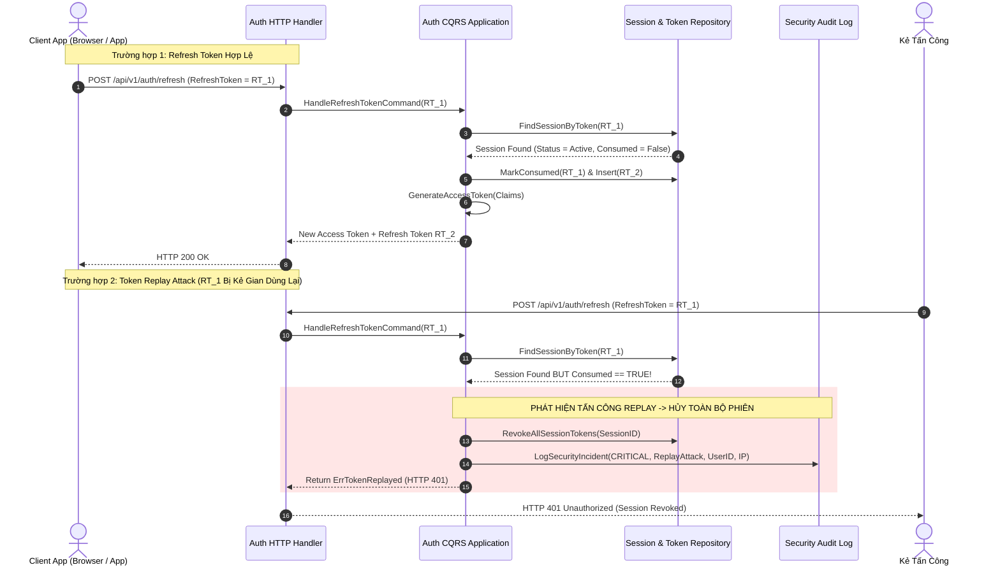
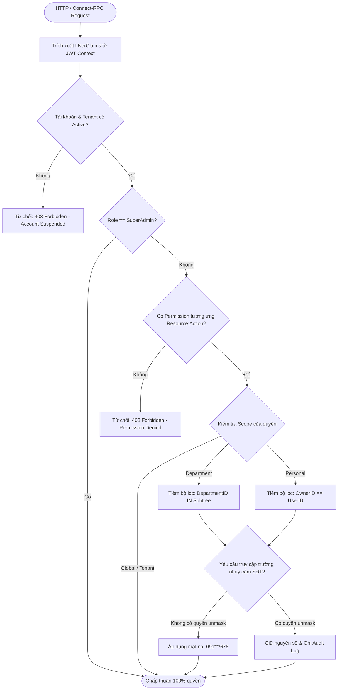
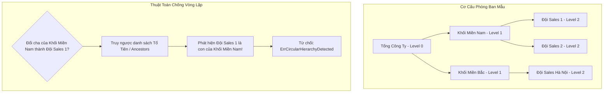

# Identity & Settings — Đặc Tả Luồng Nghiệp Vụ & Sơ Đồ UML (Workflows)

> **Bounded Context:** `internal/identity`  
> **Phạm vi:** Luồng xoay vòng Refresh Token chống Replay Attack, Cây phân quyền RBAC phân cấp, và Cơ chế phân giải Claims.

---

## 1. Sơ Đồ Xoay Vòng Refresh Token & Chống Replay Attack (Sequence Diagram)

---

## 2. Sơ Đồ Đánh Giá Phân Quyền Động Đa Tầng (RBAC Decision Tree)

Quy trình middleware và authorizer thẩm định yêu cầu truy cập tài nguyên:

---

## 3. Cấu Trúc Cây Phòng Ban & Thuật Toán Chống Vòng Lặp (Department Hierarchy)

