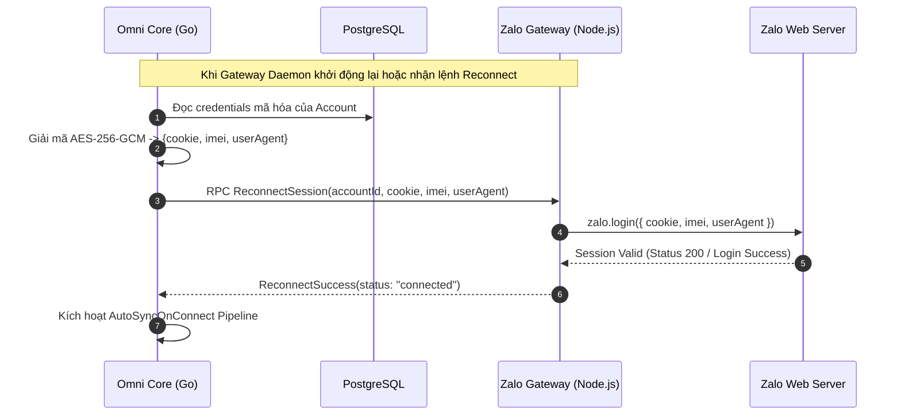
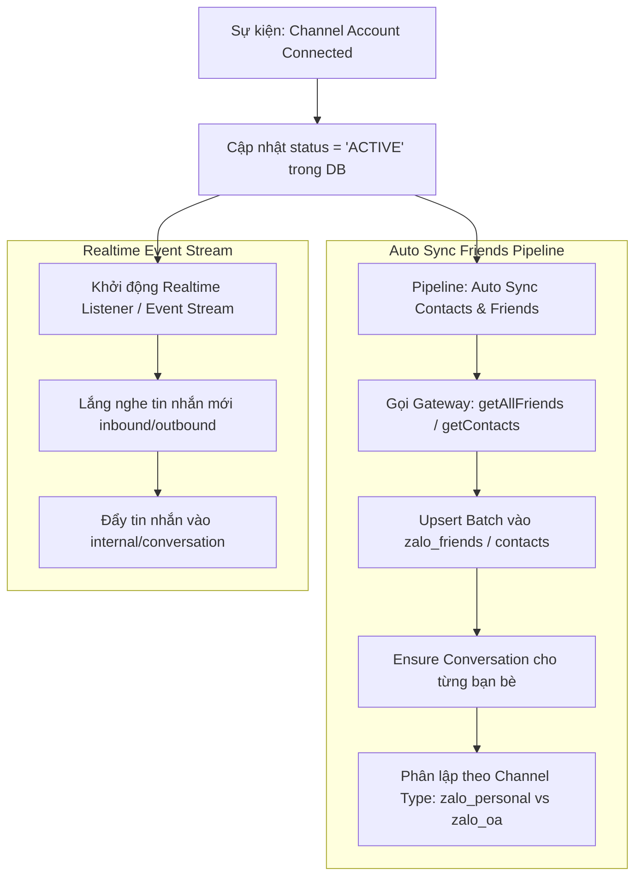

# Channel Session Persistence, Fingerprint & Reconnect Specification
> **Tài liệu đặc tả kiến trúc lưu trữ phiên đăng nhập, chống lệch chữ ký/fingerprint, và cơ chế tự động tái kết nối (Auto-Reconnect & Auto-Sync) cho Zalo Personal & WhatsApp Personal.**

---

## 1. Bản Chất Vấn Đề Văng Phiên (Session Invalidation)

Cả Zalo Web và WhatsApp Web đều áp dụng cơ chế xác thực đa yếu tố gắn chặt phiên đăng nhập với **Fingerprint phần cứng/trình duyệt**:

1. **Zalo Personal (ZCA Protocol)**:
   - Zalo kiểm tra chữ ký số `signkey` trên mỗi request dựa vào cặp `(imei, userAgent)`.
   - Nếu `userAgent` khi gọi `zalo.login()` khác với `userAgent` lúc quét mã `zalo.loginQR()`, hoặc `imei` bị sinh mới ngẫu nhiên, Zalo backend phát hiện sai lệch môi trường và **hủy phiên ngay lập tức** (`Invalid Session / 401 Unauthorized`).
   - Việc chỉ lưu mảng `cookie` mà không lưu đồng bộ `imei` và `userAgent` là nguyên nhân cốt lõi khiến Gateway bị văng session khi restart.

2. **WhatsApp Personal (Baileys / Multi-Device Protocol)**:
   - Xác thực qua Noise Protocol và Signal Protocol (cặp khóa Curve25519).
   - Phiên đăng nhập gồm 2 phần: `creds` (thông tin định danh client, account signature) và `keys` (pre-keys, signed-pre-key, identity-key, sender-keys).
   - WhatsApp gán phiên với Browser Fingerprint (`[BrowserName, OSName, Version]`). Nếu fingerprint này thay đổi khi khởi động lại, máy chủ WhatsApp sẽ gửi sự kiện `connection.update: { connection: 'close', lastDisconnect: { error: 401 } }` (bị đăng xuất từ điện thoại).

---

## 2. Đặc Tả Lưu Trữ & Phục Hồi Phiên Zalo Personal

### 2.1 Cấu Trúc Dữ Liệu `ZaloCredentials`
Khi quét mã QR thành công, sự kiện `GotLoginInfo` (event type `4`) trả về thông tin đăng nhập. Gateway và Core BẮT BUỘC phải lưu giữ đầy đủ bộ 3 trường:

```typescript
interface ZaloCredentials {
  cookie: ZaloCookieItem[];   // Mảng cookies các domain id.zalo.me, chat.zalo.me, zaloapp.com
  imei: string;              // IMEI cố định sinh từ userAgent qua generateZaloUUID
  userAgent: string;         // Chuỗi User-Agent cố định tương thích phiên ZCA
}

interface ZaloCookieItem {
  name: string;
  value: string;
  domain: string;
  path: string;
  expires?: number;
}
```

### 2.2 Thuật Toán Sinh & Cố Định Fingerprint
```javascript
// utils/zalo-crypto.js
import crypto from 'crypto';

// Tạo IMEI cố định duy nhất dựa trên userAgent hoặc Account ID
export function generateZaloUUID(userAgent, accountId = '') {
  const seed = `${userAgent}:${accountId}`;
  return crypto.createHash('md5').update(seed).digest('hex');
}
```
**Quy tắc bất biến:**
- Mỗi tài khoản Zalo gắn cố định với một chuỗi `userAgent` chuẩn (ví dụ: `Mozilla/5.0 (Windows NT 10.0; Win64; x64) AppleWebKit/537.36 (KHTML, like Gecko) Chrome/128.0.0.0 Safari/537.36`).
- Chuỗi `userAgent` này được sinh ra lúc bắt đầu gọi `loginQR` và phải được bảo tồn nguyên vẹn để dùng lại trong suốt vòng đời của tài khoản.

### 2.3 Cơ Chế Lưu Trữ Vào PostgreSQL
Tại bảng `channel_accounts` của Bounded Context Channel (`internal/channel`):
- Toàn bộ object `ZaloCredentials` được mã hóa đối xứng **AES-256-GCM** trước khi lưu vào cột `credentials` (JSONB / TEXT).
- Khóa mã hóa `SESSION_ENCRYPTION_KEY` được quản lý qua biến môi trường hoặc Secret Manager.

```sql
-- Cột credentials trong bảng channel_accounts lưu dữ liệu mã hóa:
-- {
--   "encrypted": "base64_ciphertext...",
--   "iv": "base64_iv...",
--   "tag": "base64_auth_tag..."
-- }
```

### 2.4 Quy Trình Tái Kết Nối (Boot Rehydrate & Auto-Reconnect)



---

## 3. Đặc Tả Lưu Trữ & Phục Hồi Phiên WhatsApp Personal (Go Native whatsmeow)

### 3.1 Cấu Trúc whatsmeow Multi-Device Store
Bộ xác thực và session state của `whatsmeow` được đóng gói trong `store.Device`:
1. `Registration`: `RegistrationID`, `NoiseKey`, `IdentityKey`, `SignedPreKey`.
2. `Sessions & Keys`: Được quản lý tự động bởi `whatsmeow/store/sqlstore`.
3. `PushName & JID`: Thông tin danh tính tài khoản WhatsApp khi handshake thành công.

### 3.2 Chiến Lược Lưu Trữ với `sqlstore` (PostgreSQL)
`whatsmeow` hỗ trợ driver SQL native. Trong Omni Core, sử dụng PostgreSQL backend dùng chung với Bun ORM:

```go
import (
    "go.mau.fi/whatsmeow/store/sqlstore"
    waLog "go.mau.fi/whatsmeow/util/log"
)

// Khởi tạo container dùng chung connection pool PostgreSQL
container, err := sqlstore.New("postgres", dbConnString, waLog.Stdout("Database", "INFO", true))
if err != nil {
    return err
}

// Khởi tạo hoặc lấy lại device store của tài khoản
deviceStore, err := container.GetFirstDevice() // hoặc container.GetDeviceByJID(jid)
client := whatsmeow.NewClient(deviceStore, waLog.Stdout("Client", "INFO", true))
```

### 3.3 Cố Định Browser Fingerprint WhatsApp
Khi khởi tạo kết nối qua `whatsmeow`, cố định thuộc tính client nhận diện phần cứng/trình duyệt:
```go
import "go.mau.fi/whatsmeow/store"

// BẮT BUỘC CỐ ĐỊNH, KHÔNG DÙNG random props
store.DeviceProps.Os = "Mac OS"
store.DeviceProps.PlatformType = waProto.DeviceProps_CHROME.Enum()
store.DeviceProps.RequireFullSync = proto.Bool(false) // Tránh crash memory khi tải lịch sử cũ
```

---

## 4. Pipeline Tự Động Kích Hoạt Sau Kết Nối (`AutoSyncOnConnect`)

Ngay sau khi trạng thái phiên chuyển sang `CONNECTED` (dù qua QR mới hay Reconnect thành công), hệ thống tự động chạy background pipeline sau:



### 4.1 Quy Tắc Phân Lập Kênh (Channel Isolation Invariant)
- Tin nhắn và hội thoại của `zalo_personal` và `zalo_oa` BẮT BUỘC phải phân định rõ qua `channel_type` và `channel_account_id`.
- Danh bạ bạn bè cá nhân (`zalo_friends`) KHÔNG ĐƯỢC lẫn lộn với người theo dõi Official Account (`zalo_oa_followers`).

### 4.2 Xử Lý Lỗi Mất Kết Nối (Error Taxonomy & Disconnect Handling)

| Tình huống | Mã lỗi / Sự kiện | Hành vi hệ thống |
|---|---|---|
| Mạng chập chờn / Socket timeout | `515 Stream Restart` / `ECONNRESET` | Tự động retry với Exponential Backoff (1s, 2s, 4s, tối đa 5 lần). Giữ nguyên credentials. |
| Người dùng bấm Đăng xuất trên App | `401 Unauthorized` / `Logged Out` | Xóa session credentials trong DB, chuyển account sang `DISCONNECTED`, bắn thông báo Web yêu cầu quét lại QR. |
| Sai lệch chữ ký / Cookie hết hạn | `Signkey Mismatch` / `Invalid Session` | Báo động SecurityPolicy, chuyển account sang `CHECKPOINT`, ngắt retry để tránh bị Zalo/Meta khóa số. |
