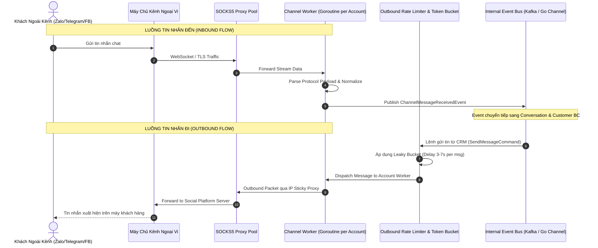
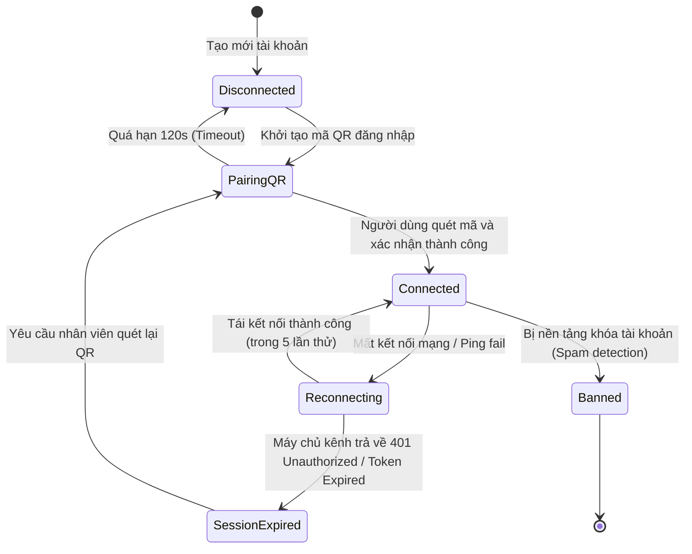
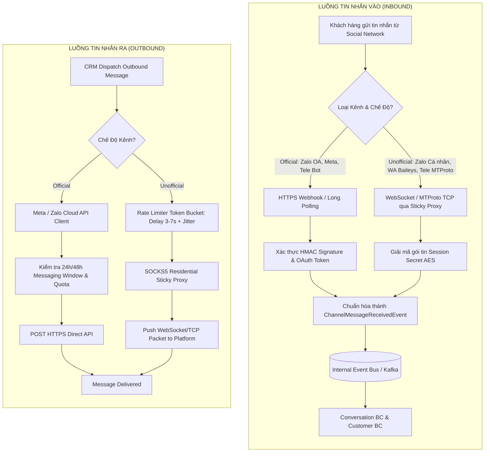

# Channel & Gateway — Đặc Tả Luồng Nghiệp Vụ & Sơ Đồ UML (Workflows)

> **Bounded Context:** `internal/channel`  
> **Phạm vi:** Luồng điều phối tin nhắn Inbound/Outbound, Cơ chế Sticky Proxy, và Watchdog giám sát phiên kết nối.

---

## 1. Sơ Đồ Điều Phối Tin Nhắn Vào / Ra (Inbound & Outbound Sequence Diagram)

---

## 2. Máy Trạng Thái Phiên Kết Nối Tài Khoản (Channel Session State Machine)

---

## 3. Sơ Đồ Điều Phối Kép: Official vs Unofficial Routing Flow

