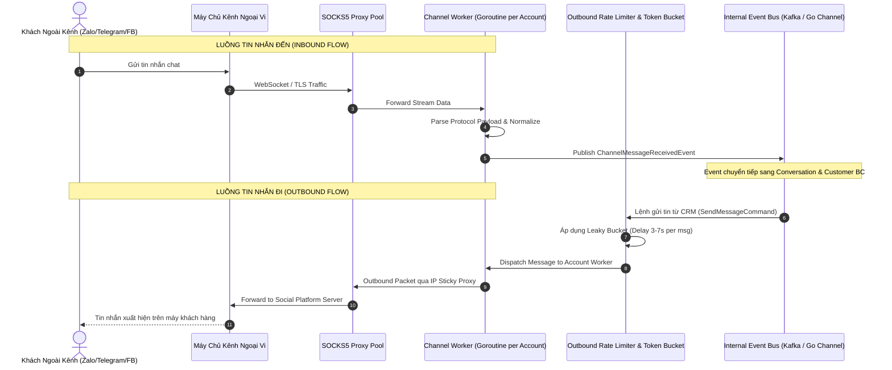
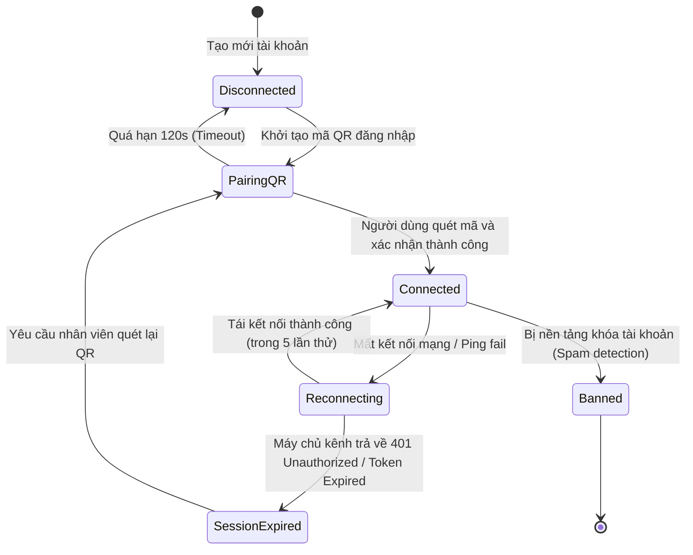
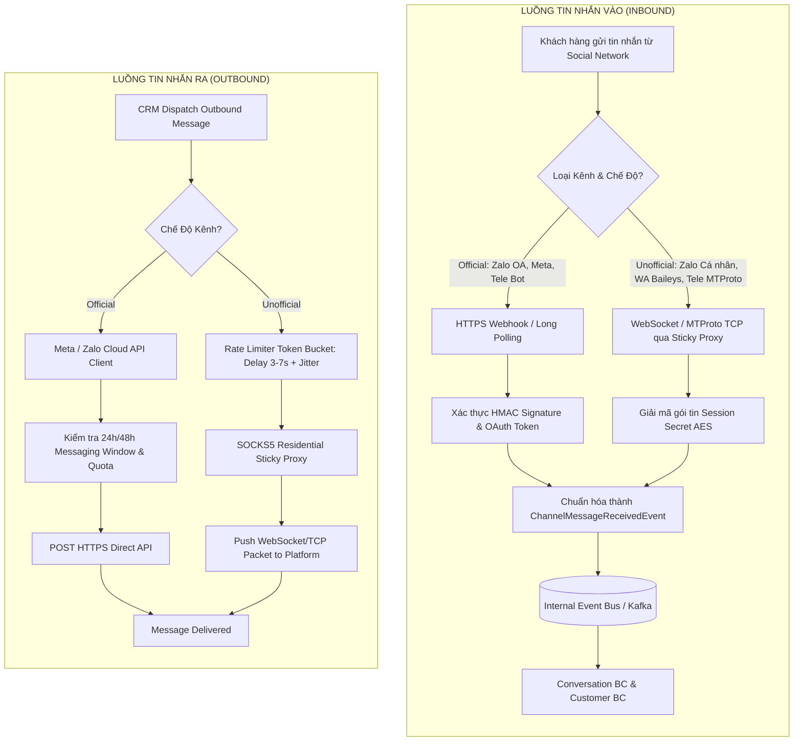
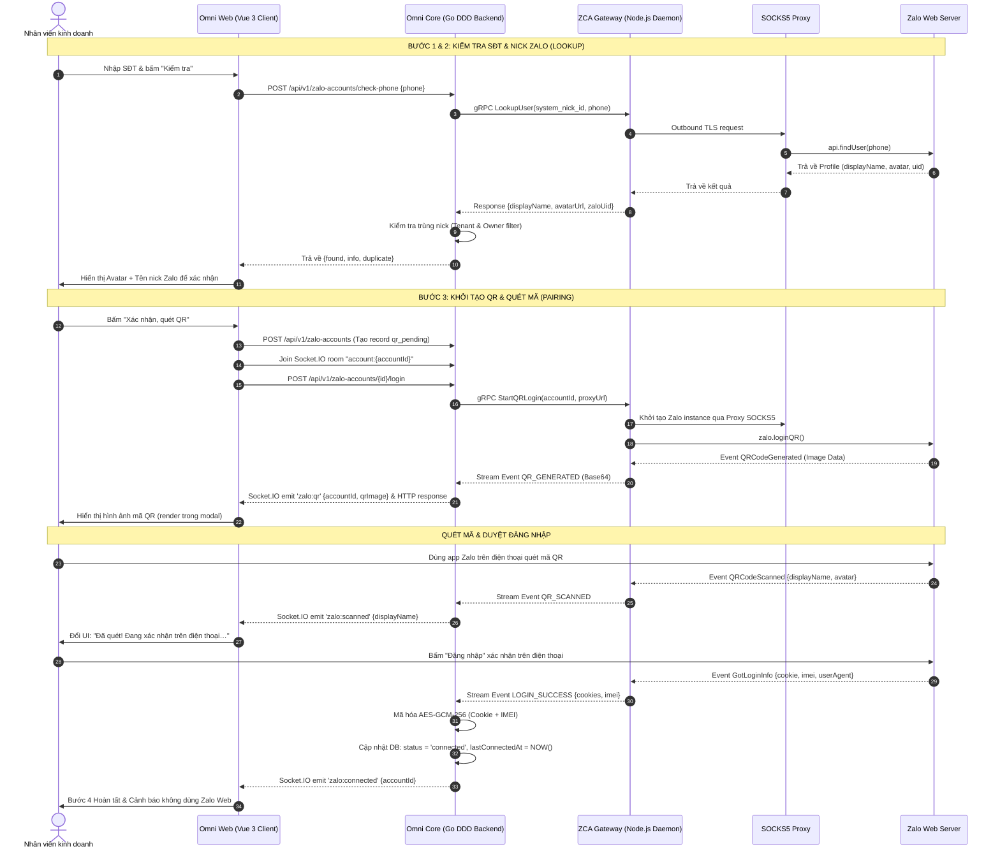
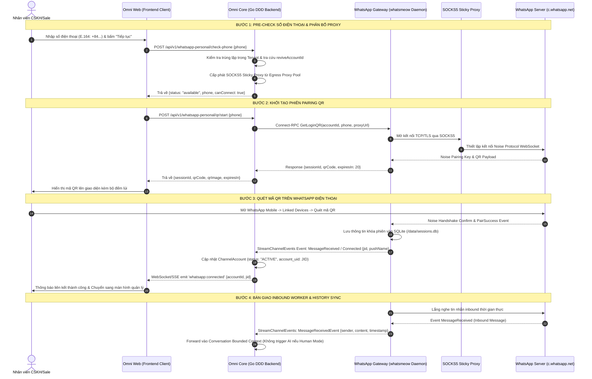

# Channel & Gateway — Đặc Tả Luồng Nghiệp Vụ & Sơ Đồ UML (Workflows)

> **Bounded Context:** `internal/channel`  
> **Phạm vi:** Luồng điều phối tin nhắn Inbound/Outbound, Cơ chế Sticky Proxy, và Watchdog giám sát phiên kết nối.

---

## 1. Sơ Đồ Điều Phối Tin Nhắn Vào / Ra (Inbound & Outbound Sequence Diagram)

---

## 2. Máy Trạng Thái Phiên Kết Nối Tài Khoản (Channel Session State Machine)

---

## 3. Sơ Đồ Điều Phối Kép: Official vs Unofficial Routing Flow

---

## 4. Quy Trình Kỹ Thuật Đăng Nhập Zalo Cá Nhân (Zalo Personal QR Login Sequence Diagram)

Sơ đồ tuần tự phối hợp 5 thành phần: **Trình duyệt (Vue 3 Client)**, **Omni Core (Go Backend)**, **ZCA Gateway Daemon (Node.js `zca-js`)**, **SOCKS5 Sticky Proxy**, và **Zalo Platform Server**.

---

## 5. Quy Trình Kỹ Thuật Đăng Nhập WhatsApp Cá Nhân (WhatsApp Personal QR Multi-Device Sequence Diagram)

Sơ đồ tuần tự phối hợp 5 thành phần: **Trình duyệt (Web Client)**, **Omni Core (Go Backend)**, **WhatsApp Gateway Daemon (Go `whatsmeow`)**, **SOCKS5 Sticky Proxy**, và **WhatsApp Server (`c.whatsapp.net`)**.

---

## 5. Máy Trạng Thái Phiên Đăng Nhập QR (Zalo QR Session State Machine)

```mermaid
stateDiagram-v2
    [*] --> Idle: Mở modal nhập SĐT
    Idle --> LookingUp: Bấm "Kiểm tra" (check-phone)
    LookingUp --> Confirming: Tra cứu thành công (Found/Fallback)
    LookingUp --> Blocked: Trùng nick người khác (Owned by other)
    Blocked --> [*]: Đóng modal

    Confirming --> GeneratingQR: Bấm "Xác nhận, quét QR"
    GeneratingQR --> QRDisplayed: Nhận mã QR (zalo:qr)
    QRDisplayed --> Scanned: Người dùng quét mã (zalo:scanned)
    
    QRDisplayed --> QRExpired: Quá hạn 120s (zalo:qr-expired)
    QRExpired --> GeneratingQR: Tự động retry (< 3 lần)
    QRExpired --> QRDead: Vượt quá 3 lần retry (zalo:qr-session-dead)
    QRDead --> GeneratingQR: Người dùng bấm "Tạo QR mới"

    Scanned --> Connected: Xác nhận trên điện thoại (zalo:connected)
    Connected --> [*]: Hoàn tất (Done)
```

