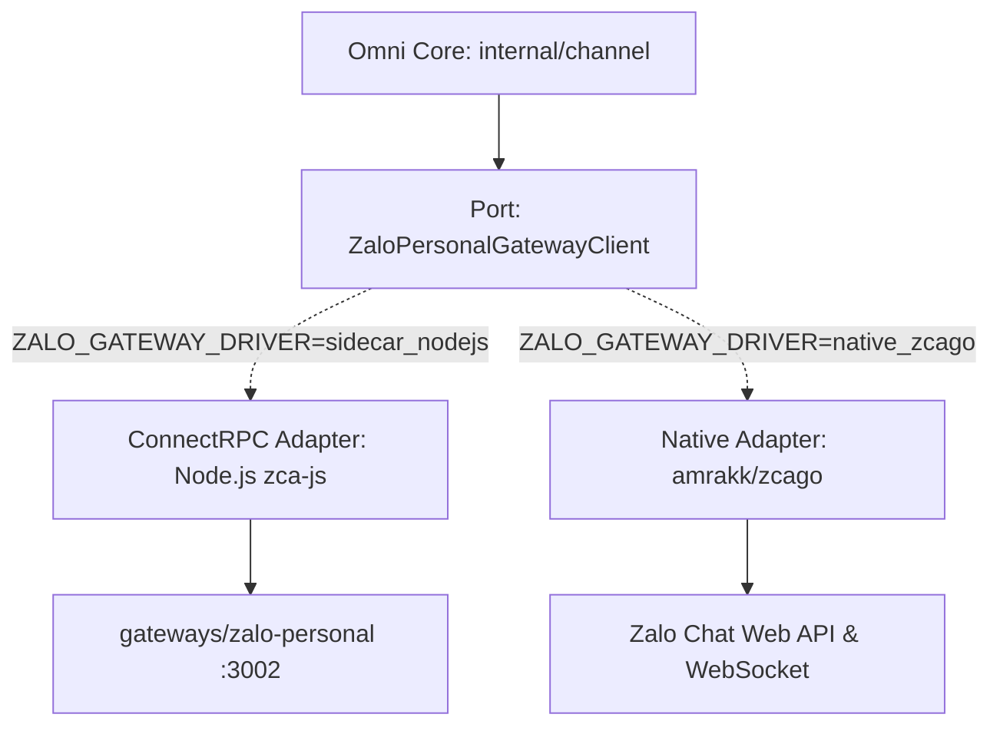

# Đặc Tả Kiến Trúc & Kế Hoạch Đánh Giá Thay Thế Zalo Gateway (zca-js vs zcago)

> **Mục tiêu:** Đánh giá khả năng thay thế Gateway Zalo Personal sidecar viết bằng Node.js (`zca-js`) sang Golang native sử dụng thư viện `amrakk/zcago`.
> **Cơ chế:** Thiết kế mô hình Adapter có switch qua biến môi trường (`ZALO_GATEWAY_DRIVER=sidecar_nodejs|native_zcago`) để chạy thử nghiệm, benchmark song song, chống rủi ro gián đoạn hệ thống.

---

## 1. Tổng Quan & So Sánh Kỹ Thuật: `zca-js` vs `zcago`

Cả hai thư viện đều reverse-engineering giao thức web client nội bộ của Zalo (Zalo Chat Web API, WebSocket e2ee/packet, signkey generation).

| Tiêu chí | `gateways/zalo-personal` (`zca-js`) | Golang Native (`amrakk/zcago`) |
|---|---|---|
| **Ngôn ngữ & Runtime** | Node.js (TypeScript/JavaScript, V8 Engine) | Pure Go (Golang 1.22+, Goroutines) |
| **Mô hình triển khai** | Out-of-process Sidecar Daemon (RPC Connect/gRPC sang Core) | Hỗ trợ 2 chế độ: In-process trực tiếp trong Core hoặc Micro-gateway độc lập |
| **Tiêu tốn RAM / Session** | ~80MB - 150MB per process/session pool | ~5MB - 15MB per session (Goroutine + light buffer) |
| **Độ trễ & Overhead** | Tốn chi phí IPC/RPC serialization giữa Node.js và Go Core | Zero-copy / In-memory trực tiếp nếu chạy embedded, hoặc RPC nội bộ |
| **Cơ chế QR & Session** | Quét QR qua web session, lưu cookie + imei + userAgent | Trả link QR / Base64 / Terminal QR; Session struct lưu cookie, imei, userAgent |
| **Quản trị Concurrency** | Node.js Event Loop đơn luồng, dễ nghẽn khi parse nhiều packet to | Native Go Scheduler (M:N), mỗi Zalo Account chạy 1 background listener goroutine |
| **Tính ổn định & Update** | Thư viện `zca-js` có cộng đồng lớn hơn, thường xuyên cập nhật khi Zalo đổi signkey | `zcago` mới hơn, cần theo dõi sát các bản cập nhật khi Zalo đổi thuật toán mã hóa |

---

## 2. Thiết Kế Dual-Driver Adapter Pattern (Env Switch)

Để đảm bảo không gián đoạn dịch vụ khi đánh giá, Omni Core áp dụng **Hexagonal Adapter** với cổng trừu tượng `ZaloPersonalGatewayClient`:



### 2.1 Cấu Hình Biến Môi Trường (`.env`)
```bash
# Driver chọn Zalo Gateway:
# 1. sidecar_nodejs: Gọi Connect-RPC sang sidecar Node.js (mặc định hiện tại)
# 2. native_zcago: Chạy Go driver trực tiếp bằng thư viện amrakk/zcago
ZALO_GATEWAY_DRIVER=sidecar_nodejs

# Cấu hình cho Driver sidecar_nodejs
ZALO_GATEWAY_URL=http://localhost:3002

# Cấu hình cho Driver native_zcago
ZALO_ZCAGO_WORKER_POOL=50
ZALO_ZCAGO_RECONNECT_BACKOFF=3s
```

### 2.2 Interface Chuẩn Hóa
```go
// internal/channel/infrastructure/client/zalo_gateway_client.go
type ZaloPersonalGatewayClient interface {
    GenerateLoginQR(ctx context.Context, sessionID string) (*channelv1.GenerateLoginQRResponse, error)
    CheckLoginStatus(ctx context.Context, sessionID string) (*channelv1.CheckLoginStatusResponse, error)
    FindUserByPhone(ctx context.Context, senderAccountID, phone string) (*channelv1.FindUserByPhoneResponse, error)
    GetGroups(ctx context.Context, accountID string) (*channelv1.GetGroupsResponse, error)
    GetGroupMembers(ctx context.Context, accountID, groupID string) (*channelv1.GetGroupMembersResponse, error)
    SendGroupMessage(ctx context.Context, req *channelv1.SendGroupMessageRequest) (*channelv1.SendGroupMessageResponse, error)
}
```

### 2.3 Factory Provider Khởi Tạo Có Switch Env
```go
func NewZaloGatewayClientFromEnv(cfg *config.Config, httpClient *http.Client) ZaloPersonalGatewayClient {
    switch cfg.ZaloGatewayDriver {
    case "native_zcago":
        return NewZcagoNativeClient()
    case "sidecar_nodejs":
        fallthrough
    default:
        return NewZaloPersonalGatewayClient(cfg.ZaloGatewayURL, httpClient)
    }
}
```

---

## 3. Lộ Trình Đánh Giá & Benchmark (4 Bước)

### Bước 1: PoC Kiểm Tra Khả Năng Tương Thích của `zcago`
- Kiểm tra tính tương thích với credentials đang lưu trong PostgreSQL: `(cookie, imei, userAgent)`.
- Đo lường cơ chế giữ phiên: Liệu `zcago` có bị văng session (mã lỗi 401 / signkey mismatch) khi chạy lâu không.
- Thử nghiệm gửi/nhận tin nhắn text, hình ảnh, thông báo nhóm.

### Bước 2: Triển Khai Adapter `ZcagoNativeClient`
- Cài đặt `github.com/amrakk/zcago` vào `omni-core`.
- Viết adapter cài đặt interface `ZaloPersonalGatewayClient`.
- Map các data types của `zcago` sang domain entities của `omni-core`.

### Bước 3: Đấu Nối Switch Env & Unit/Integration Tests
- Bổ sung cấu hình `ZALO_GATEWAY_DRIVER` vào `pkg/config`.
- Chạy song song test suite: Cả 2 driver đều phải vượt qua bài test giả lập.

### Bước 4: Chạy Thử Nghiệm Staging & So Sánh Tải (Benchmark)
- Thiết lập 10 tài khoản Zalo chạy qua `sidecar_nodejs` và 10 tài khoản chạy qua `native_zcago`.
- Thu thập số liệu qua Prometheus/Loki:
  1. Tỷ lệ rớt kết nối / văng session sau 24h.
  2. Mức tiêu thụ RAM và CPU trên từng tài khoản.
  3. Thời gian xử lý gói tin inbound (Message Received Latency).

---

## 4. Rủi Ro Cần Lưu Ý
1. **Zalo đổi thuật toán mã hóa signkey**: Nếu Zalo cập nhật web client, thư viện mã nguồn mở nào cập nhật chậm sẽ bị gián đoạn. Việc giữ lại switch `sidecar_nodejs` giúp ta fallback tức thì nếu 1 bên gặp lỗi.
2. **Quản lý goroutine leak**: Khi có hàng trăm tài khoản online, `zcago` cần quản lý chặt vòng đời websocket và goroutine đọc gói tin, hủy qua `context.WithCancel()`.
