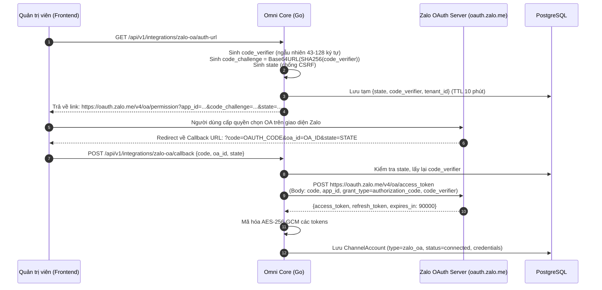

# Zalo Official Account (OA) Domain, API & Integration Specification

> **Tài liệu đặc tả kiến trúc kết nối Official API, OAuth 2.0 PKCE, Token Auto-Refresh, Webhook Ingestion, và cơ chế gửi tin nhắn cho Zalo Official Account (Zalo OA) trong hệ thống Omni Core.**
> **Bounded Context:** `internal/channel` (Adapter/Infrastructure) kết hợp với `internal/conversation`, `internal/customer`.

---

## 1. Bản Chất Kiến Trúc: Official API vs Unofficial Gateway

Khác biệt hoàn toàn với Zalo Personal (chạy qua sidecar Gateway Node.js/ZCA giả lập trình duyệt):

| Tiêu chí | Zalo Personal (Unofficial) | Zalo Official Account (Official) |
|---|---|---|
| **Kiến trúc mạng** | Đi qua Gateway Sidecar (`zca-js` / RPC bridge) | Gọi trực tiếp HTTP REST API của OpenAPI Zalo |
| **Xác thực** | Quét QR lấy Cookie, IMEI, UserAgent | OAuth 2.0 PKCE (`access_token`, `refresh_token`) |
| **Vòng đời Token** | Cố định theo session, tái kết nối qua keep-alive | `access_token` sống 25 giờ; `refresh_token` sống 3 tháng |
| **Inbound Event** | WebSocket ZCA đẩy về Gateway -> Core | HTTP Webhook từ máy chủ Zalo về Core (`POST /api/v1/integrations/zalo/webhook`) |
| **Proxy / Checkpoint** | Cần Egress Proxy SOCKS5 dân cư chống khóa nick | Không cần proxy; gọi từ IP máy chủ Core |
| **Người dùng định danh** | Zalo UID cá nhân (`zalo_user_id`) | User ID nội bộ OA (`user_id_by_app` / Zalo User ID scoped by OA) |

---

## 2. Chu Trình Xác Thực OAuth 2.0 PKCE & Quản Trị Token

Zalo OA bắt buộc dùng OAuth 2.0 với chuẩn bảo mật **PKCE (Proof Key for Code Exchange)**.



### 2.1 Cấu Trúc Bảng Lưu Trữ `channel_accounts` (OA Record)
```sql
-- Dữ liệu cột credentials (JSONB mã hóa AES-256-GCM):
{
  "app_id": "1234567890",
  "oa_id": "9876543210",
  "access_token": "enc_access_token_base64...",
  "refresh_token": "enc_refresh_token_base64...",
  "expires_at": 1727780000, -- epoch timestamp hết hạn access_token
  "refresh_token_expires_at": 1735500000
}
```

### 2.2 Token Auto-Refresh Daemon
`access_token` có hiệu lực trong 25 giờ (90,000 giây). Background worker trong Omni Core chạy định kỳ mỗi 30 phút kiểm tra:
* Nếu `expires_at - now() < 1 hour`: Tự động gọi API đổi token mới:
  ```http
  POST https://oauth.zalo.me/v4/oa/access_token
  Content-Type: application/x-www-form-urlencoded
  secret_key: {ZALO_APP_SECRET}

  app_id={APP_ID}&grant_type=refresh_token&refresh_token={CURRENT_REFRESH_TOKEN}
  ```
* Nhận về cặp `access_token` và `refresh_token` mới -> Cập nhật DB và bộ nhớ cache.

---

## 3. Webhook Ingestion: Tiếp Nhận & Xác Thực Sự Kiện Realtime

Máy chủ Zalo bắn trực tiếp các HTTP POST request về endpoint của Omni Core.

### 3.1 Endpoint & Kiểm Tra Chữ Ký (HMAC SHA-256)
* **Endpoint**: `POST /api/v1/integrations/zalo-oa/webhook`
* **Quy chuẩn bảo mật**:
  Header `X-ZEvent-Signature` hoặc trường `mac` được kiểm tra:
  ```
  mac = hex(HMAC_SHA256(app_id + raw_body + timestamp + oa_secret_key))
  ```
  Nếu không khớp chữ ký -> Phản hồi HTTP `401 Unauthorized` ngay lập tức.

### 3.2 Phân Loại Sự Kiện (Event Taxonomy)

| Event Name | Mô tả | Xử lý trong hệ thống |
|---|---|---|
| `user_send_text` | Khách gửi tin nhắn văn bản vào OA | Đẩy vào `internal/conversation`, tạo/tìm conversation với `channel_type=zalo_oa`. |
| `user_send_image` | Khách gửi hình ảnh | Tải ảnh về hoặc lưu URL CDN, tạo message type `IMAGE`. |
| `user_send_file` | Khách gửi tài liệu (PDF, Word,...) | Tạo message type `FILE`. |
| `user_send_sticker` | Khách gửi nhãn dán | Tạo message type `STICKER`. |
| `follow` | Khách bấm quan tâm / Follow OA | Ingest vào `internal/customer` (tạo/cập nhật liên hệ, gán tag `zalo_oa_follower`). |
| `unfollow` | Khách bỏ quan tâm OA | Cập nhật cờ `is_following = false` trong `internal/customer`. |

---

## 4. Đặc Tả Gửi Tin Nhắn Outbound (Zalo OpenAPI v3.0)

Gửi tin nhắn qua Zalo OA tuân theo chính sách tương tác của Zalo:
1. **Tin phản hồi tư vấn (CS Text/Media)**: Chỉ gửi được cho khách đã nhắn tin vào OA trong vòng **48 giờ** gần nhất.
2. **Tin mẫu tương tác (Template/Notification)**: Dành cho thông báo giao dịch, lịch hẹn, gửi qua ZNS (Zalo Notification Service) hoặc Interactive Template.

### 4.1 Gửi Tin Tư Vấn (Customer Support Message)
* **URL**: `POST https://openapi.zalo.me/v3.0/oa/message/cs`
* **Headers**:
  ```http
  access_token: {CURRENT_ACCESS_TOKEN}
  Content-Type: application/json
  ```
* **Payload Mẫu (Text)**:
  ```json
  {
    "recipient": {
      "user_id": "zalo_scoped_user_id"
    },
    "message": {
      "text": "Chào bạn, Omni CRM có thể giúp gì cho bạn?"
    }
  }
  ```

---

## 5. Danh Mục Go Interfaces & HTTP Endpoints

### 5.1 HTTP Endpoints trong `internal/channel/interfaces/http/zalo_oa_handler.go`
1. `GET /api/v1/zalo-oa/auth-url`: Sinh URL ủy quyền OAuth 2.0 PKCE.
2. `POST /api/v1/zalo-oa/callback`: Tiếp nhận auth code và hoàn tất kết nối OA.
3. `GET /api/v1/zalo-oa/accounts`: Danh sách các Official Account đã liên kết của tenant.
4. `POST /api/v1/zalo-oa/:id/refresh-token`: Thủ công refresh token khi cần thiết.
5. `DELETE /api/v1/zalo-oa/:id`: Ngắt kết nối OA và thu hồi token.
6. `POST /api/v1/integrations/zalo-oa/webhook`: Tiếp nhận realtime events từ Zalo Platform.

### 5.2 Go Domain Port: `ZaloOAGatewayClient`
```go
package domain

import (
	"context"
	"time"
)

type ZaloOATokenResponse struct {
	AccessToken  string `json:"access_token"`
	RefreshToken string `json:"refresh_token"`
	ExpiresIn    int64  `json:"expires_in"`
}

type ZaloOAMessagePayload struct {
	RecipientID string
	Text        string
	AttachmentURL string
	MessageType string // text, image, file
}

type ZaloOAGatewayClient interface {
	ExchangeCode(ctx context.Context, appID, secretKey, code, codeVerifier string) (*ZaloOATokenResponse, error)
	RefreshToken(ctx context.Context, appID, secretKey, refreshToken string) (*ZaloOATokenResponse, error)
	SendCustomerSupportMessage(ctx context.Context, accessToken string, payload ZaloOAMessagePayload) (messageID string, err error)
	GetFollowers(ctx context.Context, accessToken string, offset, count int) ([]string, int, error)
	GetUserProfile(ctx context.Context, accessToken, userID string) (displayName, avatarURL string, err error)
}
```

---

## 6. Kế Hoạch Sprint & Ranh Giới File

### 6.1 Ranh Giới File Cách Ly (Multi-Agent Boundary)
* **Domain Layer**: `internal/channel/domain/zalo_oa/`
* **Application Layer**: `internal/channel/application/zalo_oa/`
* **Infrastructure Layer**: `internal/channel/infrastructure/zalo_oa/` (Chứa `zalo_oa_http_client.go` bọc REST API, không mock)
* **Interfaces Layer**: `internal/channel/interfaces/http/zalo_oa_handler.go`

### 6.2 Điểm Cần Chú Ý Tránh Trùng Lặp
* Task này hoàn toàn độc lập với Issue #289 và #291 (vốn dành riêng cho Zalo Personal Groups & ZCA Sidecar).
* Không cần khởi tạo bất kỳ code nào trên `omni-gateway` (Node.js), toàn bộ là Go native trong `omni-core`.
