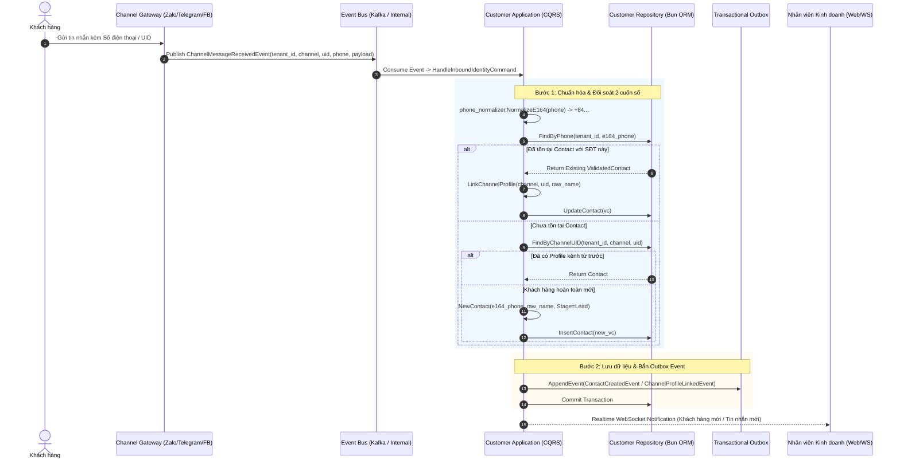
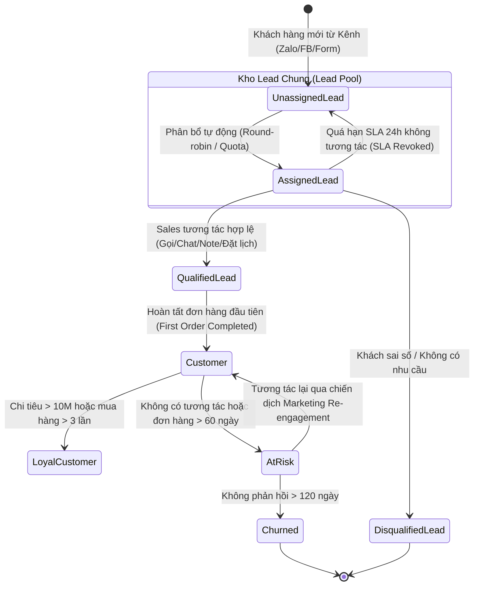
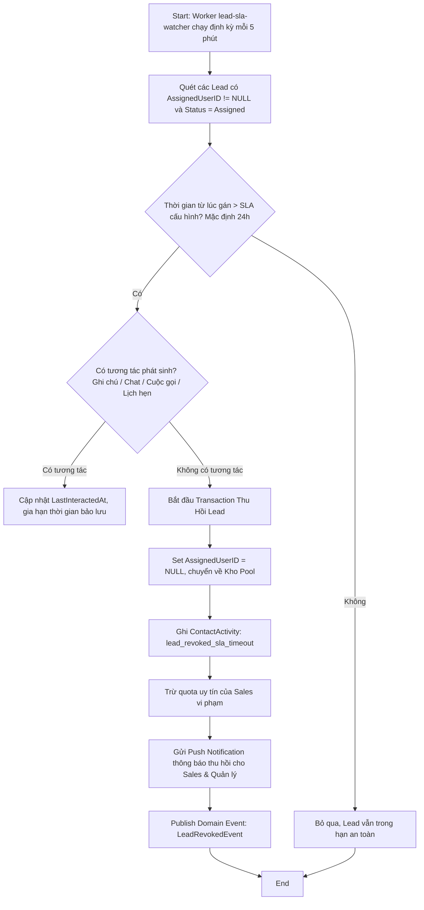
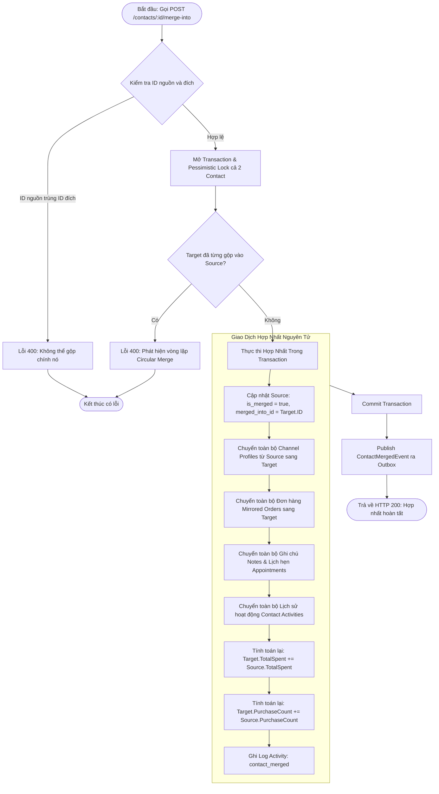

# Customer & Lead — Đặc Tả Luồng Nghiệp Vụ & Sơ Đồ UML (Workflows)

> **Bounded Context:** `internal/customer`  
> **Nguyên tắc:** Mô hình hóa trực quan bằng Mermaid UML (Sequence Diagrams, State Machine Diagrams, Activity Diagrams).  
> **Phạm vi:** Luồng định danh đa kênh, vòng đời Lead Pool, cơ chế Two-Ledger và Transactional Smart Merge.

---

## 1. Sơ Đồ Định Danh Đa Kênh & Đối Soát Golden Record (Sequence Diagram)

Quy trình giải quyết định danh khi tin nhắn từ một kênh bất kỳ (Zalo, Telegram, Facebook, Pancake) đổ về hệ thống:



---

## 2. Máy Trạng Thái Vòng Đời Khách Hàng (Customer Lifecycle State Machine)

Chuyển đổi trạng thái từ lúc là Khách hàng tiềm năng (Lead) đến khi trở thành Khách hàng chính thức (Customer), Trung thành (Loyal) hoặc Rời bỏ (Churned):



---

## 3. Quy Trình Thu Hồi Lead Tự Động Theo SLA (Activity Diagram)

Worker kiểm tra vi phạm thời hạn cam kết chăm sóc khách hàng:



---

## 4. Quy Trình Hợp Nhất Trùng Lặp Thông Minh (Smart Merge Flowchart)

Xử lý giao dịch nguyên tử (Atomic Transaction) khi gộp Source Contact vào Target Contact:



---

## 5. Mô Hình Kiến Trúc "Hai Cuốn Sổ" (Two-Ledger Architecture)

Cơ chế phân tách rõ ràng giữa dữ liệu mạng xã hội (bất biến từ Gateway) và dữ liệu quản trị doanh nghiệp (CRM Ledger):

```
┌────────────────────────────────────────────────────────────────────────┐
│                        CONTACT AGGREGATE ROOT                          │
│                                                                        │
│  [CRM LEDGER - Doanh Nghiệp Làm Chủ]                                   │
│  - FullName: "Chị Thảo Giám Đốc" (Được sửa đổi tự do)                  │
│  - PrimaryPhone: "+84912345678" (E.164 Duy nhất per Tenant)            │
│  - PrimaryEmail: "thao.tran@thuanphat.vn"                              │
│  - AssignedUserID: "sales_hoang"                                       │
│  - TotalSpent: 15,000,000 VNĐ                                          │
│  - LifecycleStage: Customer                                            │
│  - Tags: ["VIP", "B2B", "Q1-Target"]                                   │
│                                                                        │
│  [SOCIAL PROFILES LEDGER - Read-Only Sync từ Kênh Ngoại Vi]           │
│  ┌───────────────────────┐ ┌───────────────────────┐ ┌───────────────┐ │
│  │ ZaloProfile           │ │ TelegramProfile       │ │ FBProfile     │ │
│  │ - UID: 88991122       │ │ - UID: 776655         │ │ - PSID: 44332 │ │
│  │ - ZaloNick: Thảo Cute │ │ - Username: @thaotran │ │ - Name: ThaoT │ │
│  │ - Avatar: zalo.cdn/...│ │ - Phone: +84912345678 │ │ - Page: Omni │ │
│  └───────────────────────┘ └───────────────────────┘ └───────────────┘ │
└────────────────────────────────────────────────────────────────────────┘
```
