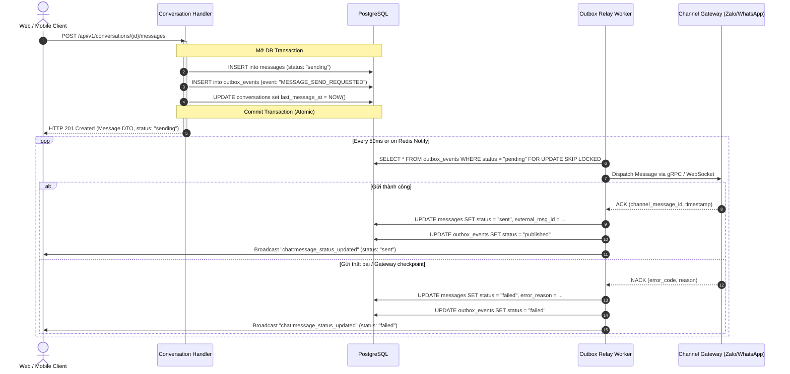
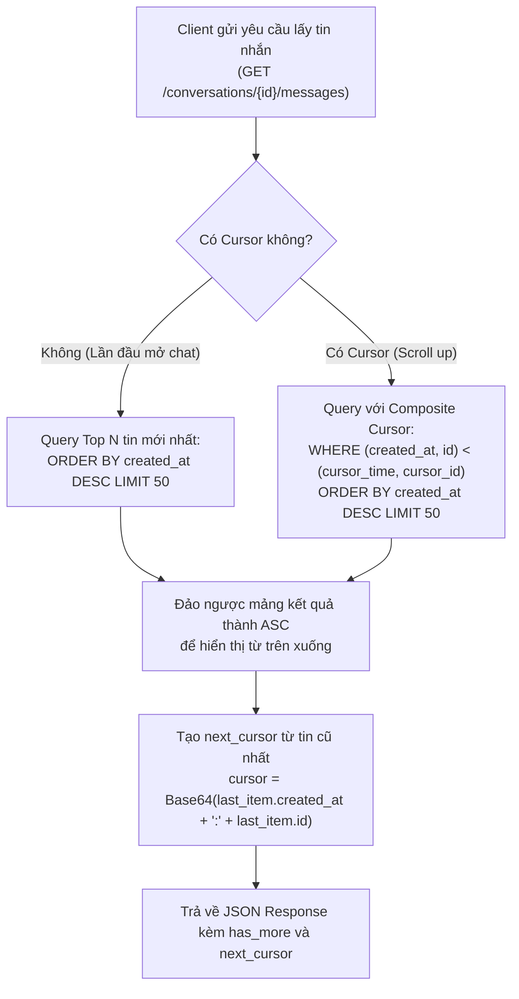

# Đặc Tả Nghiệp Vụ Chi Tiết: Conversation & Media Bounded Context (82 Endpoints)

> **Bounded Context:** `internal/conversation`  
> **Phạm vi quản lý:** Quản lý hội thoại đa kênh (Conversations), Lịch sử tin nhắn cursor-based & Outbound dispatch (Messages), Tin nhắn mẫu & Phân loại thư mục (Chat Presets & Folders), Lưu trữ & Tối ưu tệp tin đa phương tiện (Media Management & Chunked Upload), và Chuông thông báo thời gian thực (System Notifications & Push FCM).

---

## 1. Domain Model, Aggregates & Invariants (Quy Tắc Bất Biến Nghiệp Vụ)

### 1.1 Aggregate Root: `Conversation`
- **Invariants:**
  1. **Định danh kênh duy nhất (Channel Session Uniqueness):** Mỗi cặp `(tenant_id, channel_account_id, external_chat_id)` là duy nhất. Khi nhận tin nhắn inbound từ khách, hệ thống tìm hội thoại tương ứng hoặc tự động khởi tạo mới nếu chưa tồn tại.
  2. **Trạng thái vòng đời hội thoại (`ConversationStatus`):** `open`, `pending`, `snoozed`, `resolved`, `spam`, `archived`. Khi có tin nhắn mới từ khách, hội thoại ở trạng thái `resolved` hoặc `snoozed` tự động chuyển về `open`.
  3. **Phân quyền truy cập hội thoại:** Nhân viên chỉ được xem và nhắn tin trong các hội thoại thuộc các nick/kênh mà nhân viên đó được phân quyền quản lý (`channel_account_assignees`), trừ khi người dùng giữ vai trò `super_admin` hoặc `manager`.
  4. **Active Chat Lock:** Một hội thoại tại một thời điểm chỉ có tối đa 1 tư vấn viên gửi tin nhắn trực tiếp để tránh tình trạng 2 nhân viên cùng chat trùng nội dung với khách.

### 1.2 Entity & Value Object: `Message`
- **Invariants:**
  1. **Cursor-based Pagination Bất Biến:** Danh sách tin nhắn phân trang bằng `(created_at, id)` cursor để đảm bảo tính tuần tự thời gian thực tuyệt đối, không bị trùng hay nhảy trang khi có tin nhắn mới đẩy vào liên tục.
  2. **Thu hồi tin nhắn (Recall Invariant):** Tin nhắn outbound gửi qua Zalo/WhatsApp chỉ được phép thu hồi (`recall`) trong vòng 24 giờ kể từ thời điểm gửi. Không thể thu hồi tin nhắn đến từ khách hàng (`inbound`).
  3. **Idempotency Outbound Sending:** Khi client gửi tin nhắn qua REST/WebSocket, `client_msg_id` (UUID v4) bắt buộc phải truyền kèm. Nếu gặp retry mạng, server kiểm tra `client_msg_id` trong vòng 10 phút để tránh bắn trùng 2 lần tới Zalo Gateway.
  4. **Nội dung tin nhắn:** Tin nhắn text không được vượt quá 4000 ký tự (theo giới hạn an toàn của Zalo/Facebook).

### 1.3 Aggregate Root: `MediaAsset` & Chunked Upload
- **Invariants:**
  1. **Dung lượng & Định dạng hỗ trợ:**
     - Ảnh (`image/jpeg`, `image/png`, `image/webp`): Tối đa 15MB/file.
     - Video (`video/mp4`): Tối đa 50MB/file.
     - Tài liệu (`application/pdf`, `.xlsx`, `.docx`): Tối đa 25MB/file.
  2. **Chunked Upload Session:** Tệp dung lượng > 10MB bắt buộc sử dụng cơ chế upload theo phân đoạn (Chunk 5MB). Mỗi session upload chunk có TTL 24 giờ. Quá thời gian mà chưa gửi lệnh `upload-complete`, hệ thống tự động dọn dẹp các chunk rác khỏi storage tạm.
  3. **Tenant Storage Quota:** Tổng dung lượng media lưu trữ không được vượt quá giới hạn gói cước của Tenant (Subscription Plan). Nếu chạm ngưỡng 100%, chặn thao tác upload mới và gửi thông báo cảnh báo cho Admin.

---

## 2. Chi Tiết Nghiệp Vụ & BDD Cho Từng Phân Hệ Endpoints

### 2.1 Phân Hệ Chat & Tin Nhắn Đa Kênh (Conversations & Messages - 39 Endpoints)

#### EP 01-05: Quản Lý Hội Thoại (Conversations CRUD & Lọc)
- **GET `/api/v1/conversations`**:
  - **Nghiệp vụ:** Truy vấn danh sách hội thoại có phân trang. Hỗ trợ lọc theo: `channel_type` (zalo, telegram, whatsapp), `status` (open, resolved, spam), `assigned_user_id`, `unread_only=true`, `folder_id`, `tag_ids`.
- **POST `/api/v1/conversations`**:
  - **Nghiệp vụ:** Khởi tạo hội thoại mới chủ động tới khách hàng (kiểm tra tài khoản kênh còn kết nối và không bị chặn).
- **GET `/api/v1/conversations/{id}`**: Lấy chi tiết hội thoại: thông tin khách, nick kênh phụ trách, danh sách tag, ghi chú gần nhất.
- **PUT `/api/v1/conversations/{id}/assign`**: Gán hoặc chuyển giao hội thoại cho nhân viên khác chăm sóc.
- **PUT `/api/v1/conversations/{id}/status`**: Cập nhật trạng thái hội thoại (`open`, `resolved`, `spam`, `archived`).

#### EP 06-14: Lịch Sử Tin Nhắn & Outbound Dispatch
- **POST `/api/v1/conversations/{id}/read` & `/unread`**: Đánh dấu đã đọc toàn bộ tin nhắn hoặc đánh dấu chưa đọc để xử lý sau.
- **GET `/api/v1/conversations/{id}/messages`**:
  - **Nghiệp vụ:** Lấy danh sách tin nhắn theo phân trang Cursor (`limit`, `before_cursor`, `after_cursor`). Trả về danh sách tin kèm trạng thái (`sending`, `sent`, `delivered`, `read`, `failed`).
- **POST `/api/v1/conversations/{id}/messages`**:
  - **Nghiệp vụ:** Gửi tin nhắn văn bản outbound tới khách. Lưu tin nhắn vào DB, ghi Transactional Outbox event `MESSAGE_SEND_REQUESTED` để worker chuyển tiếp qua Gateway WebSocket.
  - **BDD Scenario:**
    - *Given:* Hội thoại mở trên nick Zalo đang kết nối live, nhân viên có quyền truy cập.
    - *When:* Gửi POST tới `/api/v1/conversations/{id}/messages` kèm `{"content": "Chào bạn", "clientMsgId": "uuid"}`.
    - *Then:* Trả về HTTP 201 kèm Message Object trạng thái `sending`, bắn sự kiện `message_created` qua WebSocket client.
- **POST `/api/v1/conversations/{id}/messages/media`**: Gửi tin nhắn kèm ảnh, video, tài liệu đã upload sẵn.
- **DELETE `/api/v1/messages/{id}`**: Thu hồi tin nhắn đã gửi trên Zalo/WhatsApp (kiểm tra hạn 24h).
- **POST & DELETE `/api/v1/messages/{id}/pin`**: Ghim hoặc bỏ ghim tin nhắn quan trọng trong hội thoại.
- **GET `/api/v1/conversations/{id}/pinned`**: Danh sách các tin nhắn đang được ghim.

#### EP 15-23: Thư Mục Chat & Tin Nhắn Mẫu (Folders & Presets)
- **GET, POST, PUT, DELETE `/api/v1/conversations/folders`**: CRUD thư mục phân loại chat (VIP, Khiếu nại, Khách sỉ).
- **PUT `/api/v1/conversations/{id}/folder`**: Chuyển hội thoại vào thư mục phân loại.
- **GET, POST, PUT, DELETE `/api/v1/chat/presets`**: Quản lý tin nhắn mẫu (Quick replies). Hỗ trợ chèn biến động `{name}`, `{phone}`, `{assigned_sale}` khi gửi tin.

#### EP 24-32: Tìm Kiếm, Tương Tác & Thao Tác Hàng Loạt
- **GET `/api/v1/chat/search`**: Tìm kiếm toàn văn (Full-text search) nội dung tin nhắn trong workspace.
- **POST `/api/v1/chat/forward`**: Chuyển tiếp một hoặc nhiều tin nhắn sang cuộc hội thoại khác.
- **POST `/api/v1/chat/typing`**: Phát tín hiệu đang gõ phím tới giao diện web của nhân viên khác và gửi typing status tới Zalo.
- **GET `/api/v1/conversations/{id}/timeline`**: Dòng thời gian các sự kiện xảy ra trong cuộc hội thoại (đổi người phụ trách, gắn tag, đổi trạng thái).
- **POST & DELETE `/api/v1/conversations/{id}/tags`**: Gắn và gỡ nhãn phân loại hội thoại.
- **POST `/api/v1/conversations/batch-assign`**: Phân công hàng loạt hội thoại cho một nhân viên.
- **POST `/api/v1/conversations/batch-read` & `/batch-archive`**: Đánh dấu đã đọc hoặc lưu trữ hàng loạt hội thoại.

#### EP 33-39: Tiện Ích Mở Rộng & Thống Kê Chat
- **GET `/api/v1/conversations/unread-count`**: Đếm tổng số tin nhắn chưa đọc của nhân viên đang đăng nhập.
- **GET `/api/v1/conversations/{id}/shared-links` & `/shared-files`**: Trích xuất toàn bộ link và file tài liệu đã trao đổi trong hội thoại.
- **GET & POST `/api/v1/conversations/{id}/notes`**: Ghi chú nội bộ giữa các tư vấn viên trong cuộc chat (khách hàng không thấy).
- **POST `/api/v1/conversations/export`**: Xuất nội dung trao đổi ra file PDF hoặc Excel để báo cáo.
- **GET `/api/v1/chat/stats/response-time`**: Thống kê thời gian phản hồi trung bình của sale (First Response Time - FRT).

---

## 2.2 Phân Hệ Media & Quản Lý Tệp Tin Đa Phương Tiện (24 Endpoints)

#### EP 40-45: Upload & Quản Lý Tệp Cơ Bản
- **POST `/api/v1/media/upload`**: Upload file trực tiếp lên kho lưu trữ S3/MinIO (hỗ trợ multipart/form-data).
- **POST `/api/v1/media/upload-chunk`**: Upload một phân đoạn chunk của file lớn kèm `uploadId` và `partNumber`.
- **POST `/api/v1/media/upload-complete`**: Ghép các chunk thành file hoàn chỉnh, tính toán checksum SHA-256 và kích thước thực tế.
- **GET `/api/v1/media/{id}`**: Lấy metadata tệp: kích thước, mimetype, URL công khai hoặc CDN URL.
- **DELETE `/api/v1/media/{id}`**: Xóa mềm tệp tin, đưa vào thùng rác (`is_trashed = true`).
- **GET `/api/v1/media`**: Duyệt danh sách thư viện media có phân trang và bộ lọc theo loại (`image`, `video`, `document`).

#### EP 46-52: Thư Mục Media & Watermark Ảnh
- **GET, POST, PUT, DELETE `/api/v1/media/folders`**: Quản lý cây thư mục lưu trữ media trên hệ thống.
- **POST `/api/v1/media/watermark/apply`**: Đóng dấu chìm watermark (logo, số điện thoại công ty) vào ảnh sản phẩm trước khi gửi khách.
- **GET & PUT `/api/v1/media/watermark/config`**: Cấu hình logo watermark, độ mờ (`opacity`), vị trí (góc dưới phải, chính giữa).

#### EP 53-58: Thùng Rác, Dung Lượng & Tiện Ích Tối Ưu
- **GET `/api/v1/media/trash`**: Danh sách tệp tin nằm trong thùng rác.
- **POST `/api/v1/media/trash/restore/{id}`**: Khôi phục tệp từ thùng rác.
- **DELETE `/api/v1/media/trash/empty`**: Xóa vĩnh viễn toàn bộ tệp trong thùng rác khỏi ổ cứng S3/MinIO.
- **GET `/api/v1/media/storage-usage`**: Báo cáo tổng dung lượng đã sử dụng theo Tenant và tỷ lệ phần trăm theo quota.
- **POST `/api/v1/media/thumbnails/generate`**: Tự động sinh ảnh thu nhỏ kích thước 150x150 và 300x300 phục vụ hiển thị nhanh trên app chat.
- **GET `/api/v1/media/download-url/{id}`**: Tạo presigned URL có thời hạn (15 phút) để tải file an toàn.

#### EP 59-63: Xử Lý File & Dọn Rác Hệ Thống
- **POST `/api/v1/media/compress`**: Nén dung lượng ảnh không làm suy giảm chất lượng rõ rệt trước khi bắn sang Zalo.
- **PUT `/api/v1/media/{id}/rename` & POST `/move`**: Đổi tên và di chuyển vị trí tệp tin trong cây thư mục media.
- **GET `/api/v1/media/types-summary`**: Thống kê số lượng file và dung lượng phân bổ theo từng loại tệp.
- **POST `/api/v1/media/cleanup-temp`**: Dọn dẹp các tệp tạm thời sinh ra do upload dang dở quá 24h.

---

## 2.3 Phân Hệ Thông Báo Hệ Thống & Push FCM (System Notifications - 19 Endpoints)

#### EP 64-70: Quản Lý Thông Báo Chuông (In-App Notifications)
- **GET `/api/v1/system-notifications`**: Danh sách thông báo chuông của user: phân trang, lọc theo loại hoặc trạng thái đọc.
- **POST `/api/v1/system-notifications`**: Khởi tạo thông báo nội bộ cho một hoặc nhiều user (sự kiện đơn hàng mới, lead mới phân bổ).
- **GET `/api/v1/system-notifications/{id}`**: Xem chi tiết thông báo.
- **POST `/api/v1/system-notifications/{id}/read` & `/read-all`**: Đánh dấu đã đọc một hoặc toàn bộ thông báo.
- **DELETE `/api/v1/system-notifications/{id}` & `/clear-all`**: Xóa một hoặc dọn sạch toàn bộ thông báo đã đọc.
- **GET `/api/v1/system-notifications/unread-count`**: Đếm số lượng thông báo chuông chưa đọc hiển thị badge đỏ trên header UI.

#### EP 71-77: Cấu Hình Tùy Chọn & Token Di Động (FCM Push Tokens)
- **GET & PUT `/api/v1/system-notifications/preferences`**: Bật/tắt nhận thông báo theo kênh (Email, Web Push, Mobile FCM) cho từng nhóm sự kiện.
- **POST `/api/v1/system-notifications/push-token`**: Đăng ký FCM Device Token của ứng dụng di động iOS/Android.
- **DELETE `/api/v1/system-notifications/push-token`**: Hủy đăng ký push token khi người dùng đăng xuất app mobile.
- **POST `/api/v1/system-notifications/broadcast`**: Quản trị viên phát sóng thông báo khẩn toàn hệ thống (bảo trì sàn, cập nhật tính năng).
- **GET `/api/v1/system-notifications/categories`**: Danh mục phân loại thông báo (Chat, Lead, Khách hàng, Đơn hàng, Hệ thống).
- **POST `/api/v1/system-notifications/test-push`**: Bắn thử nghiệm thông báo push tới thiết bị để kiểm tra kết nối Google FCM.

#### EP 78-82: Lịch Sử Gửi & Mẫu Thông Báo (Templates & Logs)
- **GET `/api/v1/system-notifications/logs`**: Nhật ký lịch sử gửi push notification và tỷ lệ giao nhận thành công.
- **PUT `/api/v1/system-notifications/{id}/archive`**: Lưu trữ thông báo quan trọng.
- **GET & PUT `/api/v1/system-notifications/templates`**: Quản lý nội dung mẫu thông báo tự động (placeholder `{customer_name}`, `{order_id}`).

---

## 3. Kiến Trúc Phân Luồng & Giao Vận Đa Giao Thức (Multi-Protocol Delivery)

Phân hệ Conversation vận hành đồng thời 3 giao thức để phục vụ cả Web Client, Mobile App và các sidecar daemon:

```
                      ┌─────────────────────────────────────────┐
                      │            Client Layers                │
                      │  (Next.js Web, Mobile Flutter/React-N)  │
                      └────────────────────┬────────────────────┘
                                           │
                    ┌──────────────────────┼──────────────────────┐
                    │ HTTP/REST (Go 1.22+) │ WebSocket Full-Duplex│
                    │   (Sync API & CRUD)  │   (Realtime Events)  │
                    ▼                      ▼                      ▼
           ┌─────────────────┐    ┌─────────────────┐    ┌─────────────────┐
           │   REST Mux      │    │  WebSocket Hub  │    │   Connect-RPC   │
           │ (/api/v1/chat/*)│    │ (/ws/v1/chat)   │    │(Internal/Daemon)│
           └────────┬────────┘    └────────┬────────┘    └────────┬────────┘
                    │                      │                      │
                    ▼                      ▼                      ▼
         ┌──────────────────────────────────────────────────────────────────┐
         │              CQRS Application & Domain Services                  │
         │          (Command / Query Handlers + Invariants)                 │
         └─────────────────────────────────┬────────────────────────────────┘
                                           │
                    ┌──────────────────────┴──────────────────────┐
                    │                                             │
                    ▼                                             ▼
         ┌─────────────────────┐                       ┌─────────────────────┐
         │ PostgreSQL (Bun ORM)│                       │ Redis Pub/Sub & Outbox
         │ (Conversations,     │                       │ (Realtime Broadcast,│
         │  Messages, Media)   │                       │  Gateway Forwarder) │
         └─────────────────────┘                       └─────────────────────┘
```

### 3.1 Giao thức 1: REST API (Go 1.22+ ServeMux)
- **Mục đích:** Đồng bộ dữ liệu, CRUD Conversations, gắn tag, đổi trạng thái, tải lịch sử chat, upload media multipart.
- **Quy tắc:** Mọi endpoint danh sách tuân thủ chuẩn `omni-core/pkg/pagination` hoặc Cursor pagination.

### 3.2 Giao thức 2: WebSocket Hub (`/ws/v1/chat`)
- **Mục đích:** Cung cấp kênh liên lạc hai chiều (Full-Duplex) với độ trễ thấp (< 50ms) cho người dùng cuối và tư vấn viên.
- **Quản lý kết nối:** Mỗi client kết nối được gán vào 1 connection goroutine độc lập được quản lý bởi `Hub` có giới hạn buffer channel để chống rò rỉ bộ nhớ.
- **WebSocket Event Contracts:**
  - `chat:message_received`: Bắn tới client khi có tin nhắn mới từ khách hoặc từ sale khác trong cùng hội thoại.
  - `chat:typing`: Báo hiệu trạng thái đang gõ (`{ conversation_id, sender_id, is_typing: true }`).
  - `chat:read_receipt`: Thông báo khách hoặc tư vấn viên đã đọc tin nhắn (`{ conversation_id, last_read_message_id }`).
  - `chat:conversation_assigned`: Thông báo hội thoại vừa được gán cho nhân viên mới.
  - `chat:conversation_status_changed`: Cập nhật trạng thái hội thoại (`open`, `resolved`, `spam`).

### 3.3 Giao thức 3: Connect-RPC & gRPC
- **Mục đích:** Giao tiếp nội bộ tốc độ cao giữa Conversation BC và các Gateway Sidecars (Zalo Daemon, WhatsApp Worker, Telegram MTProto) hoặc AI Copilot Worker.
- **Đặc tính:** Type-safe, Zero JSON parsing overhead, hỗ trợ bidirectional stream khi cần đồng bộ message batch lớn.

---

## 4. Transactional Outbox Pattern & Gateway Dispatch

Để đảm bảo **không bao giờ mất tin nhắn** (Zero Message Loss) và đảm bảo tính nhất quán giữa cơ sở dữ liệu và các kênh mạng xã hội bên ngoài:



---

## 5. Thuật Toán & Sơ Đồ Phân Trang Cursor-Based (High-Performance Chat History)

Khi một cuộc hội thoại có hàng ngàn tin nhắn và có hàng chục tin nhắn mới đổ về mỗi giây, phân trang truyền thống bằng `OFFSET/LIMIT` sẽ gây suy giảm hiệu năng nghiêm trọng (Full Table Scan) và gây hiện tượng trùng hoặc bỏ sót tin nhắn (Data Drift).

### 5.1 Cấu Trúc Khóa Cursor: `(created_at, id)`
Hệ thống sử dụng Composite Cursor kết hợp giữa thời gian tạo và UUID để đảm bảo tính duy nhất tuyệt đối ngay cả khi 2 tin nhắn được tạo trong cùng một millisecond.

```sql
-- Đọc tin nhắn cũ hơn (Scroll up / Load older messages)
SELECT id, conversation_id, sender_type, content, status, created_at
FROM messages
WHERE conversation_id = $1
  AND (created_at, id) < ($2, $3) -- cursor: (before_created_at, before_id)
ORDER BY created_at DESC, id DESC
LIMIT $4;
```

### 5.2 Sơ Đồ Luồng Cursor-Based



---

## 6. Ma Trận Observability, Logging & Exception Chuẩn

| Nhóm Ngoại Lệ | Danh Sách Lỗi Kỹ Thuật / Domain | Phân Loại `pkg/errors` | Hành Động Hệ Thống | Event Log `pkg/logger` |
|---|---|---|---|---|
| **Thu hồi tin nhắn** | Quá thời hạn 24h, không phải tin outbound | `CodeInvalidInput` (Terminal) | Chặn thu hồi, trả về HTTP 400 | `CONV_MESSAGE_RECALL_EXPIRED` |
| **Gửi tin trùng** | Trùng `client_msg_id` trong 10 phút | `CodeConflict` (Idempotent) | Bỏ qua gửi mới, trả về message đã tạo | `CONV_MESSAGE_DUPLICATE_IGNORED` |
| **Dung lượng Media** | Vượt quá quota lưu trữ của Tenant | `CodeForbidden` (QuotaExceeded) | Chặn upload, thông báo nâng cấp gói | `MEDIA_STORAGE_QUOTA_EXCEEDED` |
| **Định dạng file** | File không nằm trong danh mục MIME cho phép | `CodeInvalidInput` (Terminal) | Từ chối upload, trả về HTTP 415 | `MEDIA_INVALID_MIME_TYPE` |
| **Push Token lỗi** | Token FCM không hợp lệ hoặc đã bị hủy | `CodeNotFound` (Transient) | Tự động xóa token khỏi DB người dùng | `NOTIF_FCM_TOKEN_INVALID` |
| **Không tìm thấy** | Không tìm thấy Conversation, Message, Media | `CodeNotFound` (Terminal) | Trả về HTTP 404 Not Found | `CONVERSATION_NOT_FOUND` |
