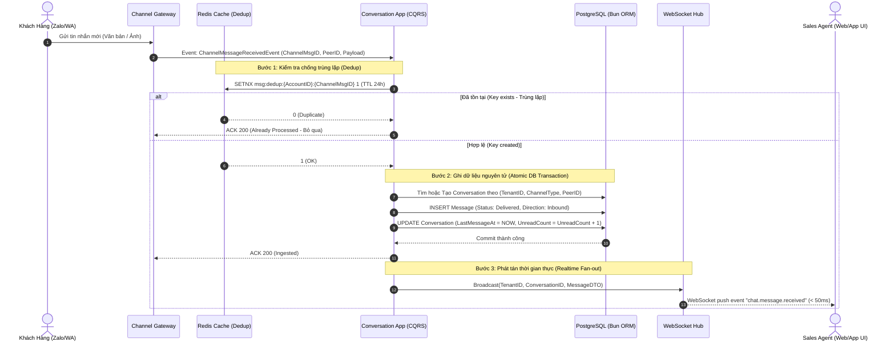
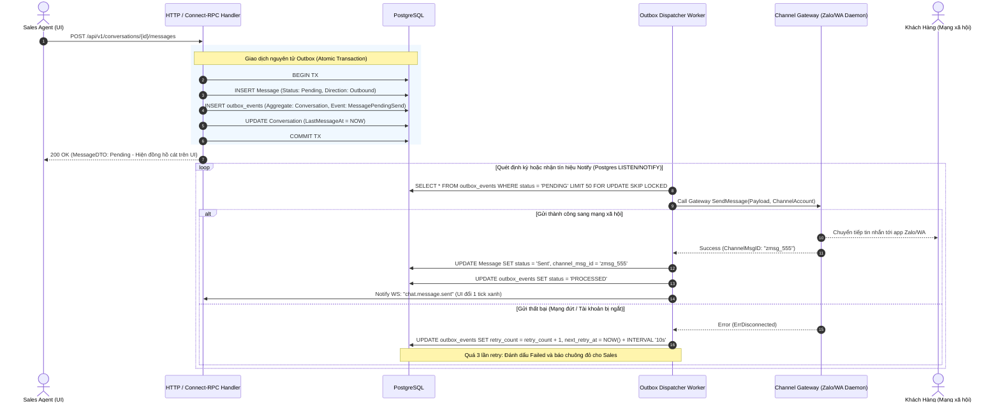
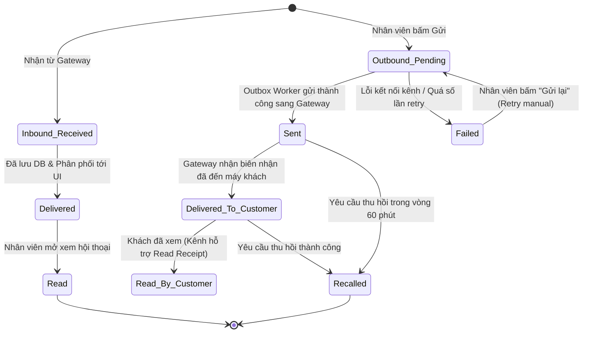
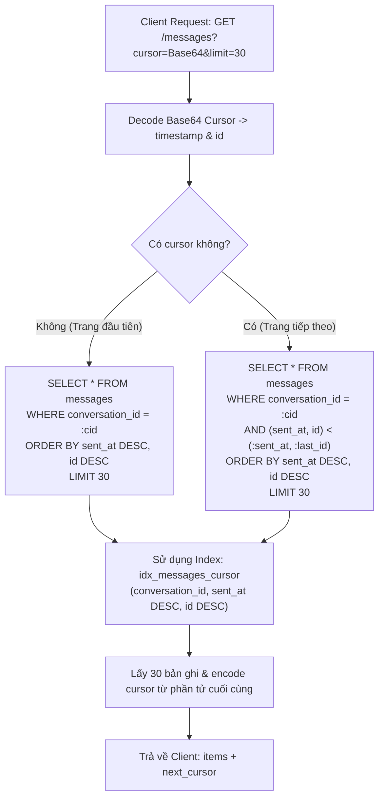

# Conversation & Media Bounded Context — Sơ Đồ Luồng Nghiệp Vụ (Workflows & UML)

> Mô hình hóa các luồng nghiệp vụ thời gian thực, giao thức phân phối tin nhắn hai chiều, Outbox Pattern, Deduplication, và cấu trúc trạng thái vòng đời hội thoại.

---

## 1. Sơ Đồ Tương Tác: Tiếp Nhận Tin Nhắn Đa Kênh (Inbound Message Ingestion)

Luồng tiếp nhận tin nhắn từ Zalo/Telegram/WhatsApp Gateway vào hệ thống với cam kết Deduplication (Redis) và Broadcast tức thời (WebSocket Hub):

---

## 2. Sơ Đồ Tương Tác: Gửi Tin Nhắn Outbound Qua Outbox Pattern

Đảm bảo nhân viên gửi tin không bị chặn giao diện và tin nhắn chắc chắn được chuyển tới Gateway ngay cả khi có sự cố mạng:

---

## 3. Sơ Đồ Máy Trạng Thái: Vòng Đời Tin Nhắn (Message Lifecycle)

Trạng thái của một tin nhắn từ lúc khởi tạo đến khi hoàn tất hoặc thu hồi:

---

## 4. Sơ Đồ Phân Trang Cursor-Based (High-Performance Chat History)

Minh họa cơ chế truy vấn Seek phân trang tin nhắn bằng B-Tree Index composite, triệt tiêu hoàn toàn `OFFSET`:

