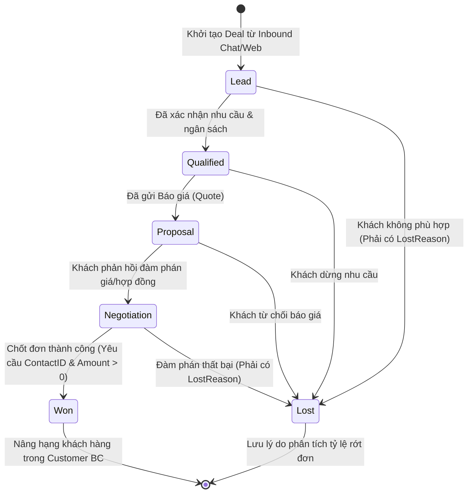
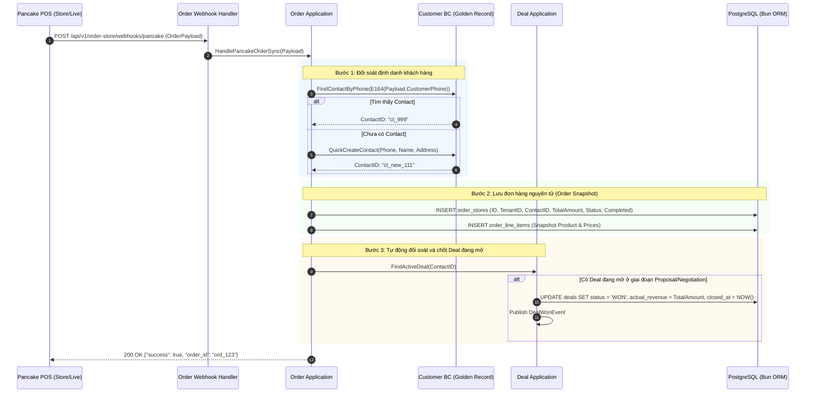
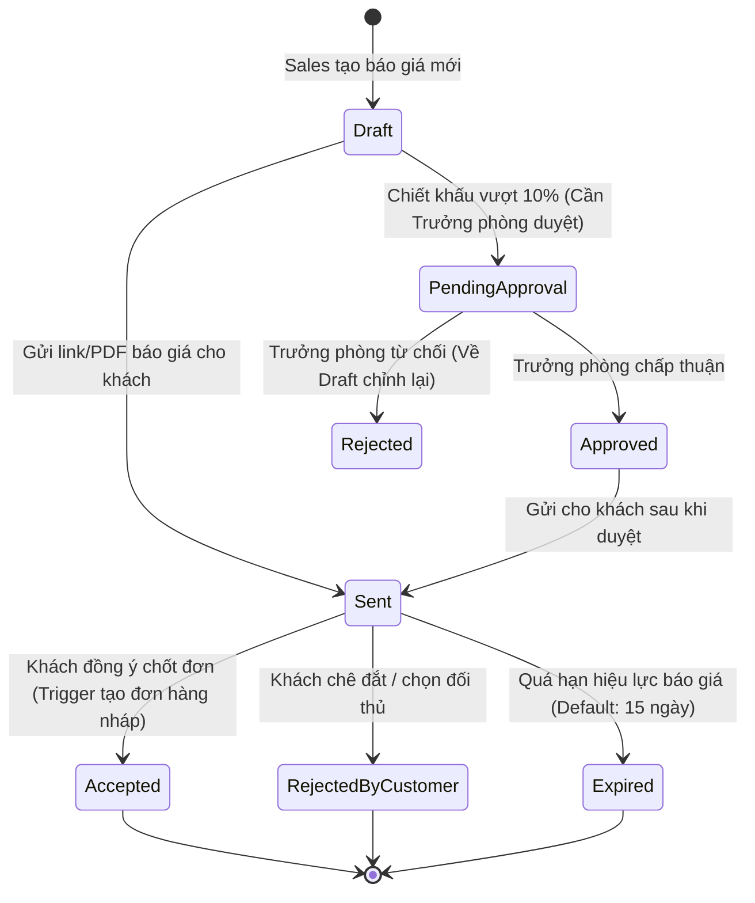

# Deal & E-commerce Bounded Context — Sơ Đồ Luồng Nghiệp Vụ (Workflows & UML)

> Mô hình hóa các luồng nghiệp vụ Phễu bán hàng (Kanban Deal Stages), Vòng đời Báo giá (Quote Lifecycle), và Đồng bộ Đơn hàng Đa kênh từ Pancake POS / KiotViet.

---

## 1. Sơ Đồ Máy Trạng Thái: Vòng Đời Deal Phễu Bán Hàng (Deal Pipeline State Machine)

Quy định các bước chuyển trạng thái hợp lệ và Invariant ràng buộc:

---

## 2. Sơ Đồ Tuần Tự: Đồng Bộ Đơn Hàng Pancake POS Về CRM (Pancake Sync Flow)

Luồng đối soát số điện thoại, liên kết đơn hàng với Golden Record và tự động đóng Deal:

---

## 3. Sơ Đồ Máy Trạng Thái: Vòng Đời Báo Giá (Quote Lifecycle)

