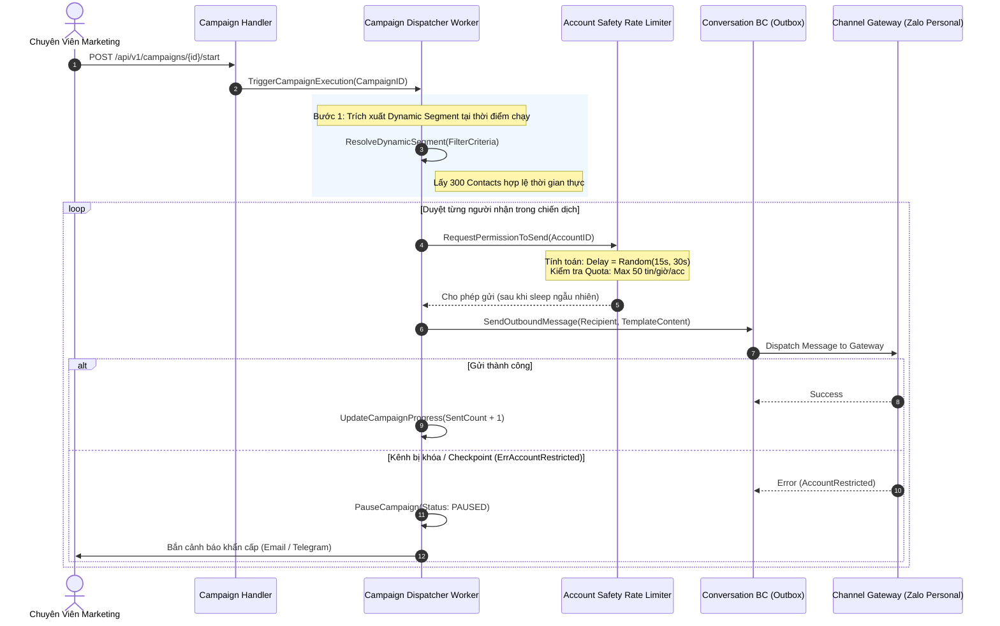
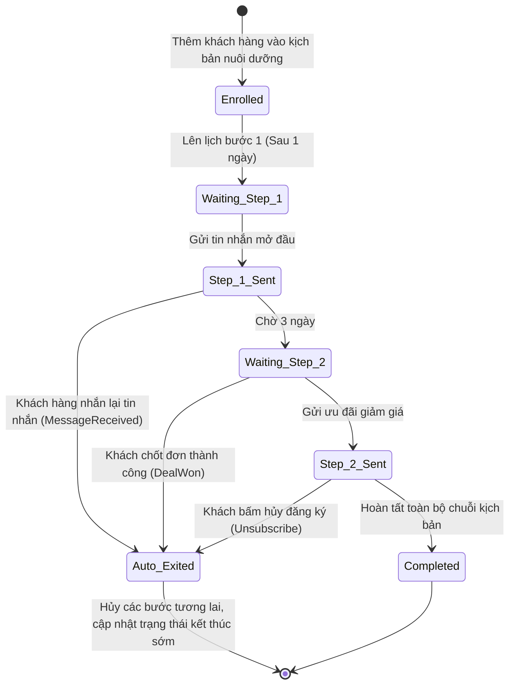
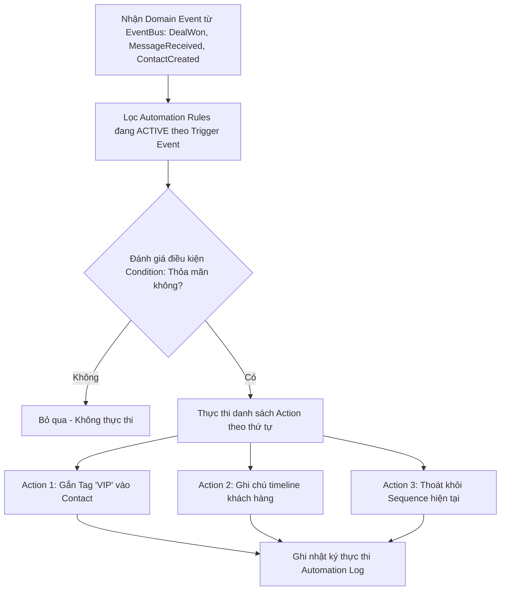

# Marketing & Automation Bounded Context — Sơ Đồ Luồng Nghiệp Vụ (Workflows & UML)

> Mô hình hóa các luồng nghiệp vụ Chiến dịch gửi tin đa kênh (Anti-Ban Broadcast), Kịch bản nuôi dưỡng (Drip Sequence Engine) và Cơ chế Auto-Exit Condition khi nhận Domain Events.

---

## 1. Sơ Đồ Tuần Tự: Gửi Tin Hàng Loạt An Toàn (Anti-Ban Broadcast Dispatcher)

Quy trình điều phối tin nhắn qua Rate Limiter có chèn Random Jitter để bảo vệ tài khoản cá nhân:

---

## 2. Sơ Đồ Máy Trạng Thái: Vòng Đời Khách Hàng Trong Drip Sequence

Minh họa việc di chuyển qua các bước (Steps) và điều kiện tự động thoát (Auto-Exit):

---

## 3. Sơ Đồ Khối: Động Cơ Tự Động Hóa (Automation Rule Engine)

