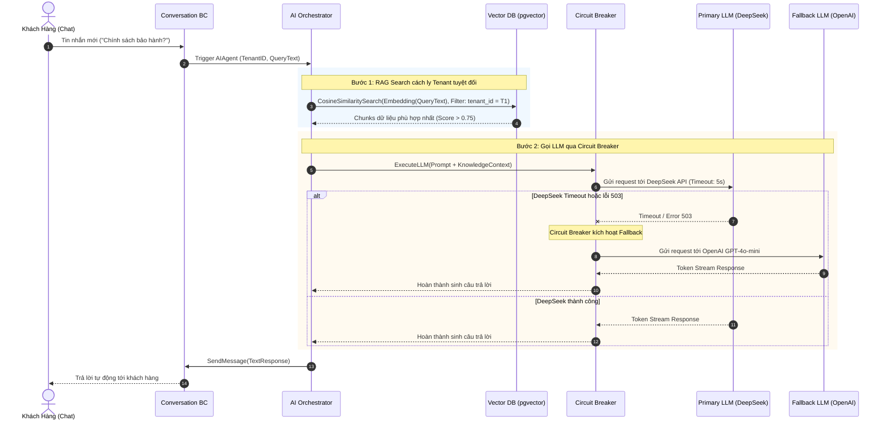
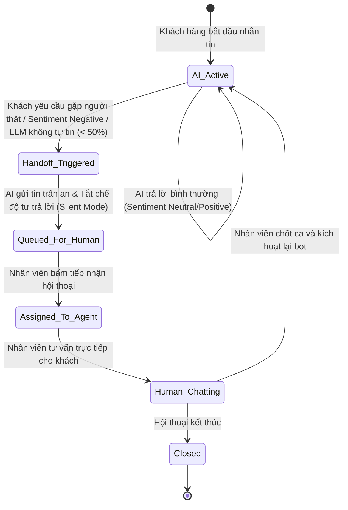
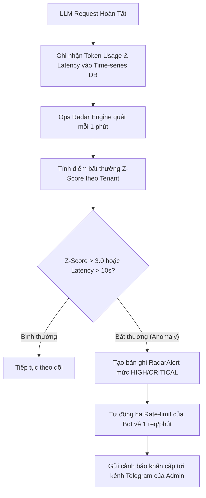
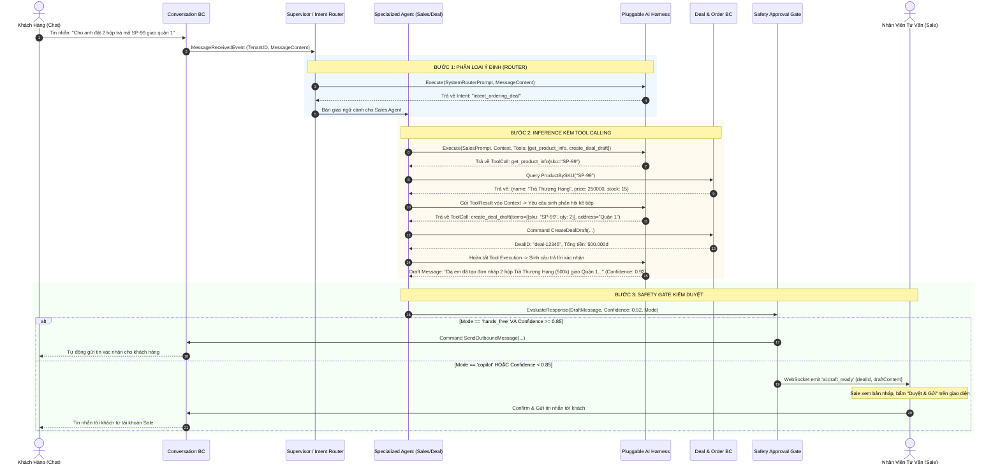
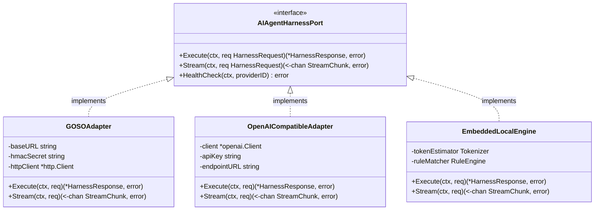

# AI Agent & Knowledge Bounded Context — Sơ Đồ Luồng Nghiệp Vụ (Workflows & UML)

> Mô hình hóa luồng xử lý RAG Search với Tenant Isolation, Cơ chế Circuit Breaker Fallback giữa các LLM Providers, Luồng Safe Human Handoff và Giám sát Ops Radar.

---

## 1. Sơ Đồ Tuần Tự: Luồng Xử Lý RAG Search & Trả Lời Đa Kênh

Cơ chế điều phối ngữ cảnh prompt, embedding tìm kiếm vector và sinh phản hồi:

---

## 2. Sơ Đồ Máy Trạng Thái: Chuyển Giao Quyền Cho Con Người (Safe Human Handoff)

Quy trình quản lý trạng thái can thiệp của AI trên cuộc hội thoại:

---

## 3. Sơ Đồ Luồng: Giám Sát Bất Thường Token & Latency (Ops Radar Loop)

Luồng kiểm soát chi phí và hiệu năng các AI Providers:

---

## 4. Sơ Đồ Tuần Tự: Multi-Agent Swarm & Tool Calling Execution Loop

Quy trình phối hợp giữa Router Agent, Specialized Agent và Tool Calling liên Bounded Context:

---

## 5. Sơ Đồ Kiến Trúc: Pluggable Inference Adapters

Mô hình trừu tượng hóa Adapter cắm rút tự do giữa Go Core và các Engine bên ngoài:

