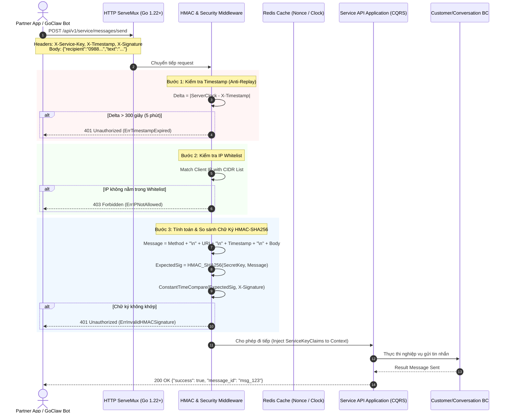
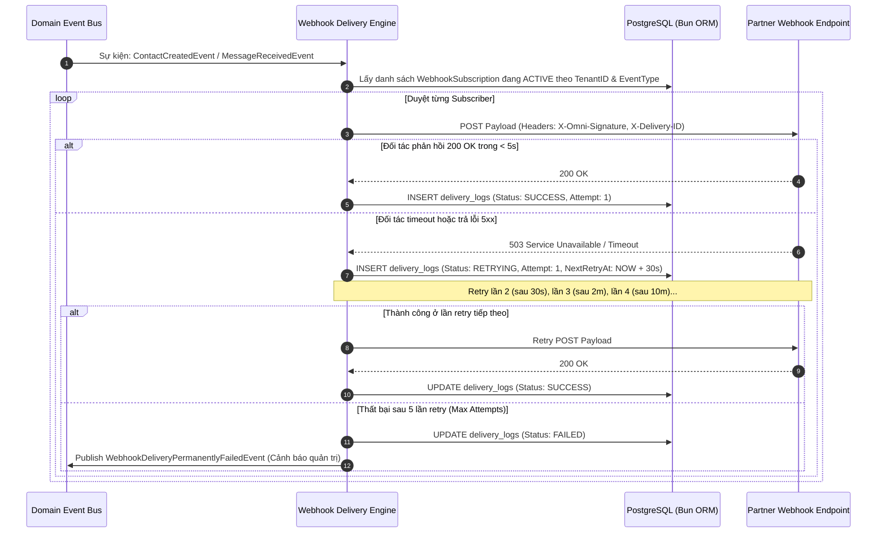
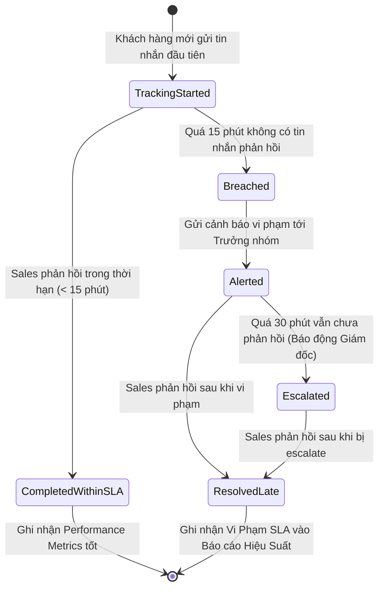

# Service API & External Gateway Bounded Context — Sơ Đồ Luồng Nghiệp Vụ (Workflows & UML)

> Mô hình hóa các luồng bảo mật HMAC-SHA256, Xác thực IP Whitelist, Chống Replay Attack, Webhook Outbound Delivery với Exponential Backoff và SLA Breach Engine.

---

## 1. Sơ Đồ Tuần Tự: Xác Thực Chữ Ký Số HMAC & Chống Tấn Công Replay Attack

Quy trình lọc và kiểm tra tính toàn vẹn của request từ bên thứ ba trước khi đưa vào Domain logic:

---

## 2. Sơ Đồ Tuần Tự: Giao Nhận Webhook Outbound & Exponential Backoff Retry

Cơ chế gửi sự kiện ra ngoài hệ thống đối tác kèm khả năng chịu lỗi mạng:

---

## 3. Sơ Đồ Máy Trạng Thái: Đo Lường & Báo Cáo Vi Phạm SLA

Vòng đời theo dõi thời gian phản hồi (First Response Time) của cuộc hội thoại:

